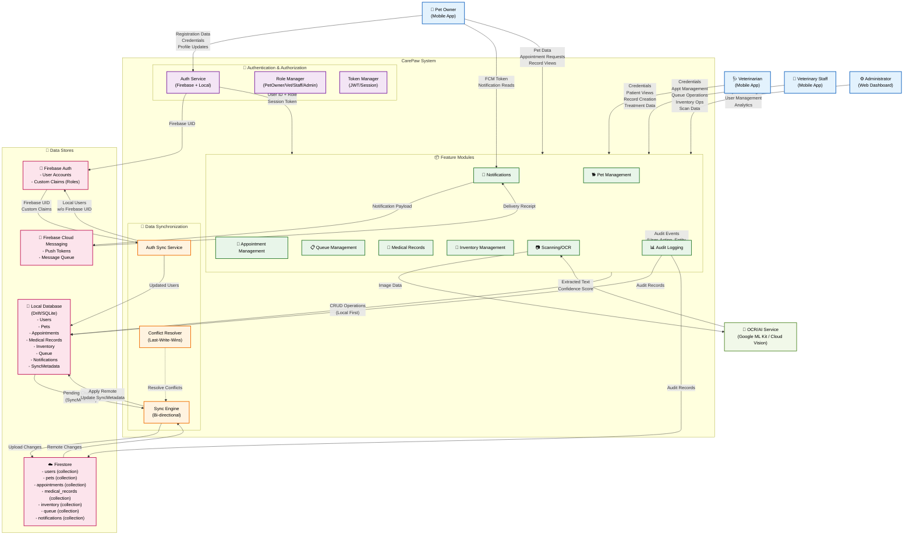
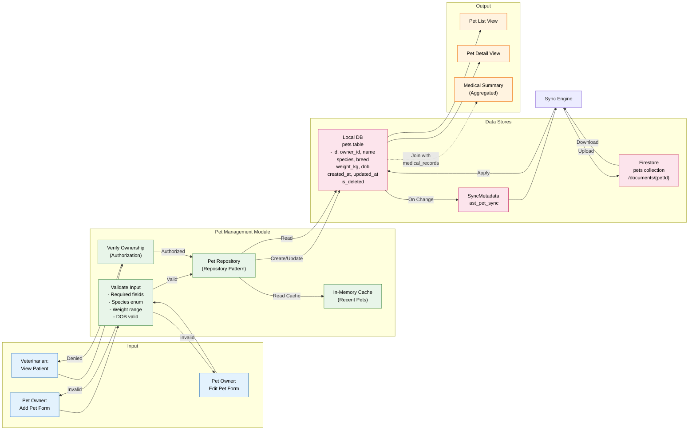
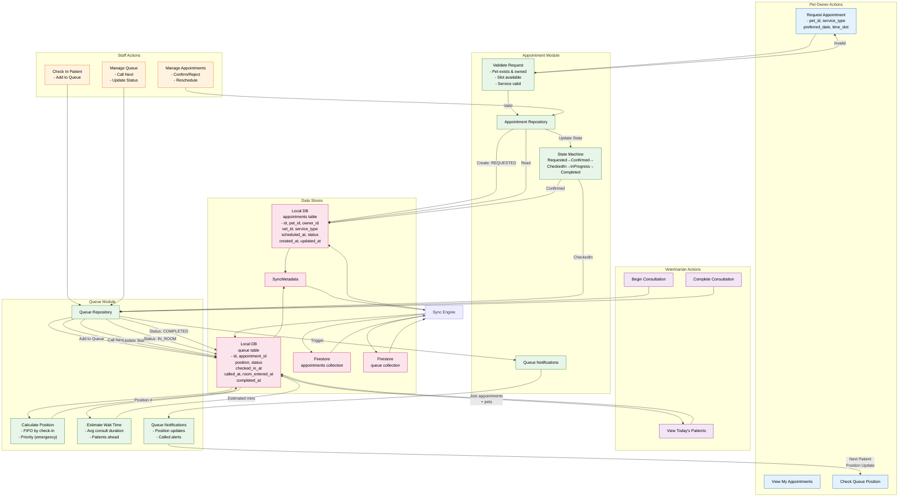
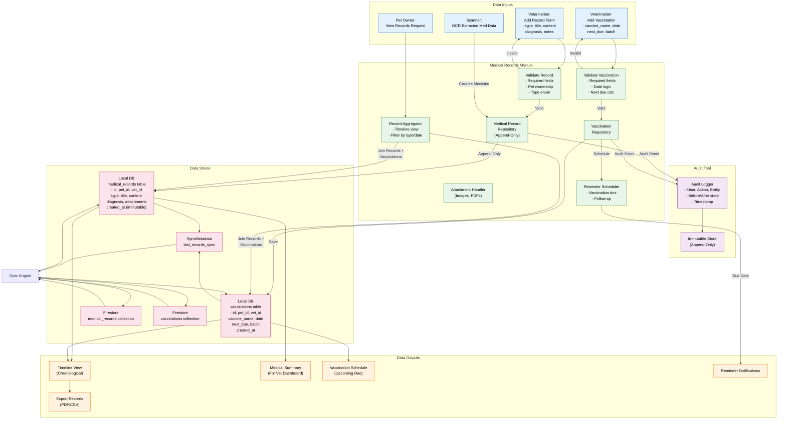
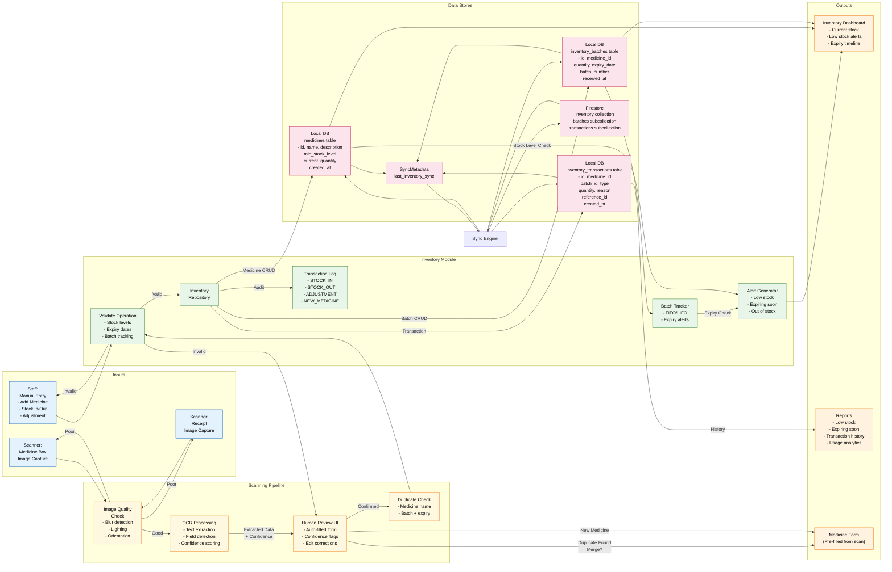
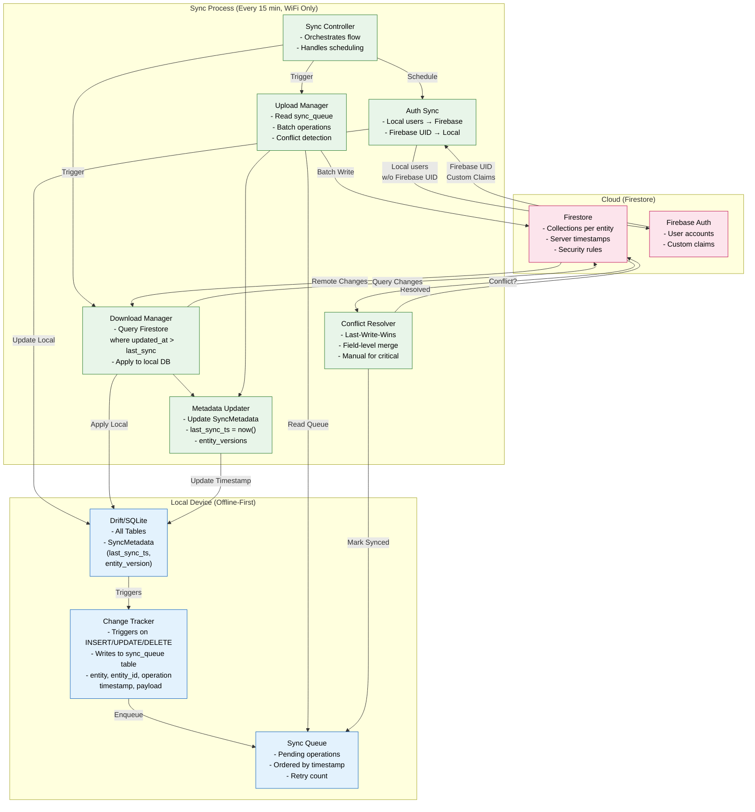
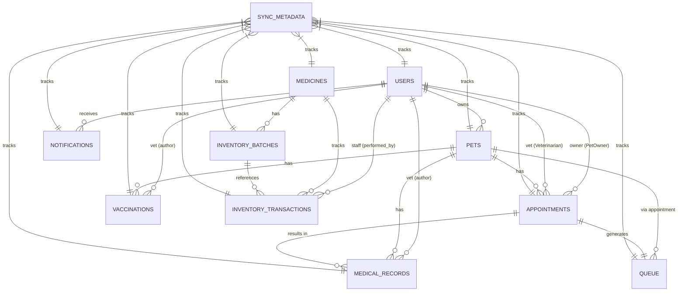
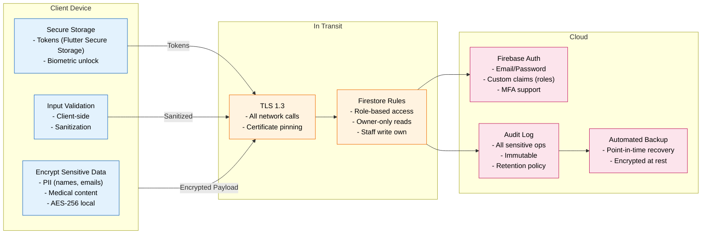

# CarePaw Data Flow Diagram

**Project:** CarePaw - Smart Veterinary Patient Management System  
**Date:** 2026-09-07  
**Status:** ✅ DOCUMENTED

---

## Data Flow Diagram Overview

This document shows how data flows through the CarePaw system - from external actors through the application layers to the data stores and back.

---

## 1. Context Level Data Flow Diagram (Level 0)



---

## 2. Pet Management Data Flow (Level 1)



---

## 3. Appointment & Queue Data Flow (Level 1)



---

## 4. Medical Records Data Flow (Level 1)



---

## 5. Inventory & Scanning Data Flow (Level 1)



---

## 6. Notification Data Flow (Level 1)

```mermaid
flowchart TB
    subgraph TRIGGERS["Event Triggers"]
        APPT_EVT["Appointment Events\n- Created\n- Confirmed\n- Rejected\n- Cancelled\n- Reminder"]
        QUEUE_EVT["Queue Events\n- Called\n- Position Update\n- Wait Time"]
        INV_EVT["Inventory Events\n- Low Stock\n- Expiring Soon\n- Out of Stock"]
        SYNC_EVT["Sync Events\n- Complete\n- Error"]
    end
    
    subgraph NOTIF_MODULE["Notification Module"]
        EVENT_ROUTER["Event Router\n- Map event →\n  notification type"]
        RECIPIENT_RESOLVER["Recipient Resolver\n- Pet owner (appt)\n- Vet (queue)\n- Staff (inventory)\n- Admin (system)"]
        CHANNEL_SELECTOR["Channel Selector\n- In-App\n- Local Push\n- Both"]
        TEMPLATE_ENGINE["Template Engine\n- Localized messages\n- Dynamic variables\n- Rich content"]
        NOTIF_REPO["Notification\nRepository"]
        DELIVERY["Delivery Service\n- In-App: Local DB\n- Push: FCM"]
        READ_TRACKER["Read Tracker\n- delivered_at\n- read_at"]
    end
    
    subgraph STORES["Data Stores"]
        LOCAL_NOTIF["Local DB\nnotifications table\n- id, user_id, type\n  title, body, data\n  channel, status\n  created_at, read_at"]
        FCM_STORE["FCM Service\n- Device tokens\n- Message queue\n- Delivery receipts"]
        SYNC_NOTIF["SyncMetadata\nlast_notif_sync"]
        REMOTE_NOTIF["Firestore\nnotifications collection"]
    end
    
    subgraph OUTPUTS["User Facing"]
        IN_APP["In-App Notification\n- Badge count\n- Notification center\n- Real-time updates"]
        PUSH_NOTIF["Push Notification\n- System tray\n- Lock screen\n- Background"]
        EMAIL["Email (Future)\n- Digest\n- Critical alerts"]
    end
    
    APPT_EVT --> EVENT_ROUTER
    QUEUE_EVT --> EVENT_ROUTER
    INV_EVT --> EVENT_ROUTER
    SYNC_EVT --> EVENT_ROUTER
    
    EVENT_ROUTER --> RECIPIENT_RESOLVER
    RECIPIENT_RESOLVER --> CHANNEL_SELECTOR
    CHANNEL_SELECTOR --> TEMPLATE_ENGINE
    TEMPLATE_ENGINE --> NOTIF_REPO
    
    NOTIF_REPO -->|Save: SENT| LOCAL_NOTIF
    NOTIF_REPO -->|In-App Channel| DELIVERY
    NOTIF_REPO -->|Push Channel| DELIVERY
    
    DELIVERY -->|In-App| IN_APP
    DELIVERY -->|Push| FCM_STORE
    FCM_STORE --> PUSH_NOTIF
    
    IN_APP -->|User Opens| READ_TRACKER
    PUSH_NOTIF -->|User Taps| READ_TRACKER
    READ_TRACKER -->|Update: READ\nread_at = now()| LOCAL_NOTIF
    
    LOCAL_NOTIF --> SYNC_NOTIF
    SYNC_NOTIF --> SYNC_ENGINE["Sync Engine"]
    SYNC_ENGINE --> REMOTE_NOTIF
    REMOTE_NOTIF --> SYNC_ENGINE
    SYNC_ENGINE --> LOCAL_NOTIF
    
    classDef trigger fill:#e3f2fd,stroke:#1565c0,color:#000
    classDef module fill:#e8f5e9,stroke:#2e7d32,color:#000
    classDef store fill:#fce4ec,stroke:#c2185b,color:#000
    classDef output fill:#fff3e0,stroke:#ef6c00,color:#000
    
    class APPT_EVT,QUEUE_EVT,INV_EVT,SYNC_EVT trigger
    class EVENT_ROUTER,RECIPIENT_RESOLVER,CHANNEL_SELECTOR,TEMPLATE_ENGINE,NOTIF_REPO,DELIVERY,READ_TRACKER module
    class LOCAL_NOTIF,FCM_STORE,SYNC_NOTIF,REMOTE_NOTIF store
    class IN_APP,PUSH_NOTIF,EMAIL output
```

---

## 7. Data Synchronization Flow (Detailed)



---

## 8. Data Entities & Relationships



---

## 9. Data Flow Summary Table

| Data Entity | Source | Local Store | Remote Store | Sync Direction | Conflict Strategy |
|-------------|--------|-------------|--------------|----------------|-------------------|
| Users | Auth (Firebase + Local) | users table | users collection | Bi-directional | Firebase UID wins |
| Pets | Pet Owner / Vet | pets table | pets collection | Bi-directional | Last-Write-Wins |
| Appointments | Pet Owner / Staff | appointments table | appointments collection | Bi-directional | State machine validates |
| Queue | Staff / Vet | queue table | queue collection | Bi-directional | Position recalculated |
| Medical Records | Vet (Append-Only) | medical_records table | medical_records collection | Bi-directional | Immutable - no conflicts |
| Vaccinations | Vet (Append-Only) | vaccinations table | vaccinations collection | Bi-directional | Immutable - no conflicts |
| Medicines | Staff / Scanner | medicines table | inventory collection | Bi-directional | Last-Write-Wins |
| Inventory Batches | Staff / Scanner | inventory_batches table | inventory/batches subcollection | Bi-directional | Last-Write-Wins |
| Inventory Transactions | Staff / System | inventory_transactions table | inventory/transactions subcollection | Append-Only | Immutable - no conflicts |
| Notifications | System Events | notifications table | notifications collection | Bi-directional | Last-Write-Wins |

---

## 10. Security & Privacy Data Flow



---

*Generated as part of CarePaw thesis project - Data Flow Diagram Documentation*