# CarePaw System Flowcharts

**Project:** CarePaw - Smart Veterinary Patient Management System
**Date:** 2026-08-26
**Status:** ✅ DOCUMENTED

---

## Table of Contents

1. [System Overview](#1-system-overview)
2. [Authentication Flow](#2-authentication-flow)
3. [Pet Owner Journey](#3-pet-owner-journey)
4. [Veterinarian Journey](#4-veterinarian-journey)
5. [Veterinary Staff Journey](#5-veterinary-staff-journey)
6. [Appointment State Machine](#6-appointment-state-machine)
7. [Queue Management Flow](#7-queue-management-flow)
8. [Inventory Management Flow](#8-inventory-management-flow)
9. [Medical Records Flow](#9-medical-records-flow)
10. [OCR/Scanning Workflow](#10-ocrscanning-workflow)
11. [Notification Flow](#11-notification-flow)
12. [Data Synchronization Flow](#12-data-synchronization-flow)

---

## 1. System Overview

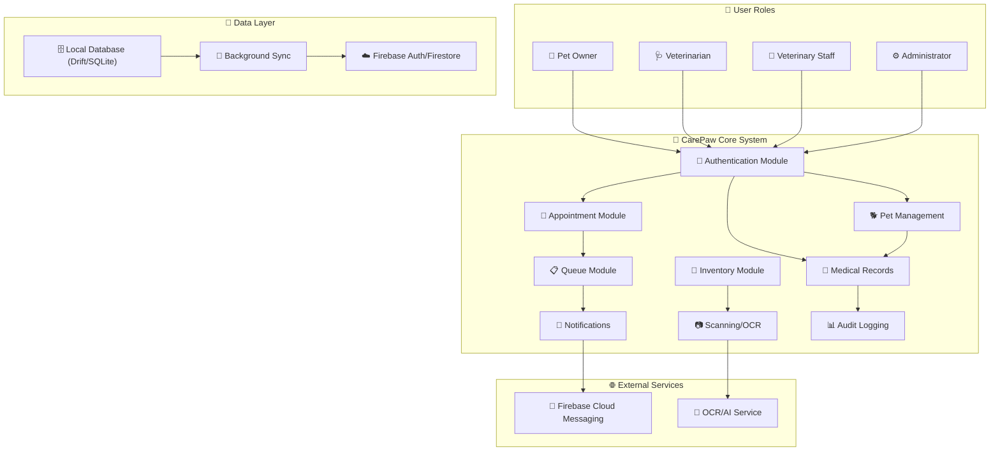

---

## 2. Authentication Flow

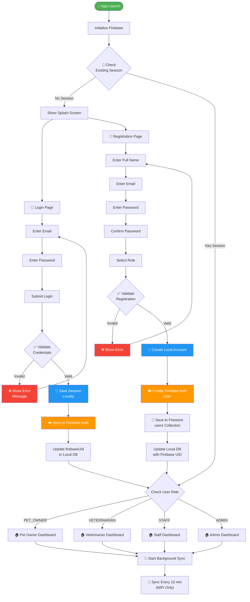

---

## 3. Pet Owner Journey

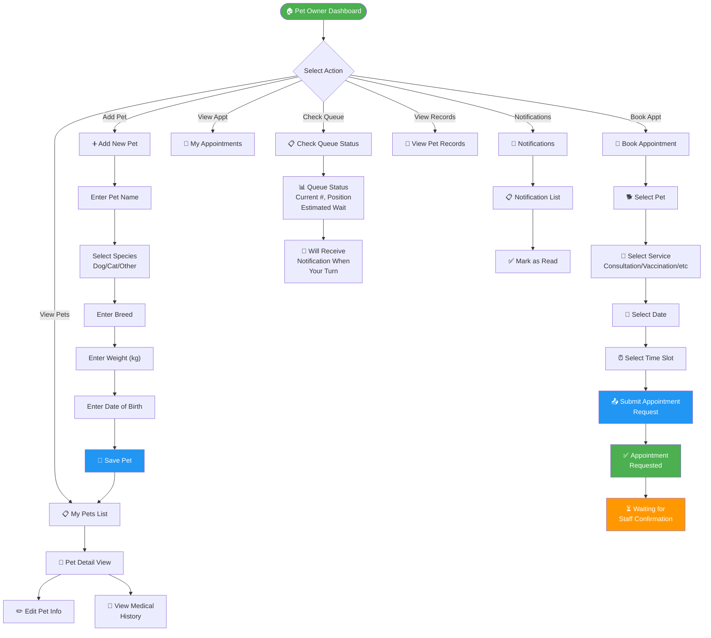

---

## 4. Veterinarian Journey

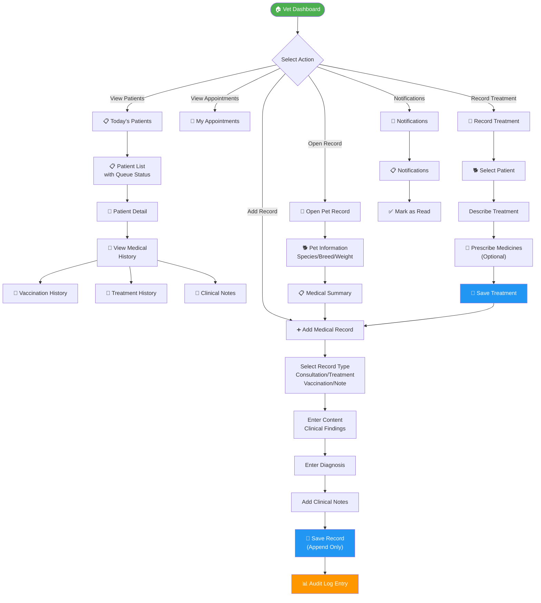

---

## 5. Veterinary Staff Journey

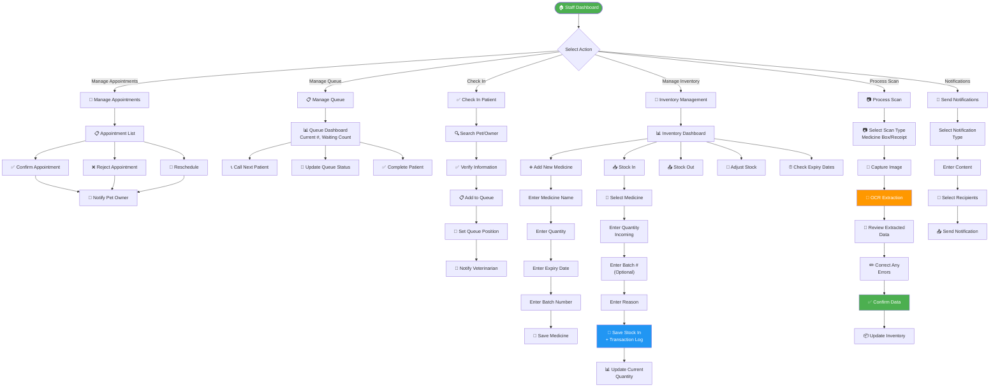

---

## 6. Appointment State Machine

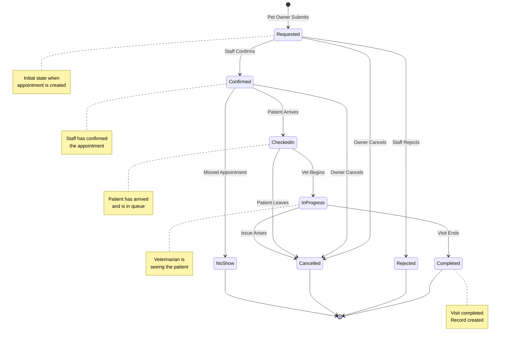

---

## 7. Queue Management Flow

```mermaid
flowchart TD
    START([📋 Queue System]) --> PATIENT_ARRIVES["🏥 Patient Arrives"]

    PATIENT_ARRIVES --> STAFF_CHECK["Staff Verifies\nAppointment"]
    STAFF_CHECK --> CONFIRM_APT{"Appointment\nConfirmed?"}

    CONFIRM_APT -->|No| CREATE_WALKIN["Create Walk-In\nAppointment"]
    CREATE_WALKIN --> ADD_QUEUE

    CONFIRM_APT -->|Yes| CHECK_IN["✅ Check In Patient"]
    CHECK_IN --> ADD_QUEUE["📋 Add to Queue"]

    ADD_QUEUE --> ASSIGN_POS["🔢 Assign Queue\nPosition"]
    ASSIGN_POS --> SET_STATUS["📝 Set Status:\nWAITING"]
    SET_STATUS --> NOTIFY_VET_QUEUE["📱 Notify Vet:\nNew Patient"]

    NOTIFY_VET_QUEUE --> WAIT_CALL["⏳ Waiting to\nBe Called"]

    WAIT_CALL --> VET_READY["🩺 Vet Ready\nfor Next Patient"]
    VET_READY --> CALL_NEXT["📞 Call Next\nin Queue"]
    CALL_NEXT --> UPDATE_STATUS_CALLED["📝 Status: CALLED"]
    UPDATE_STATUS_CALLED --> PATIENT_MOVES["🚶 Patient Moves\nto Exam Room"]
    PATIENT_MOVES --> UPDATE_STATUS_ROOM["📝 Status: IN_ROOM"]
    UPDATE_STATUS_ROOM --> ROOM_ENTERED["Record Room\nEntry Time"]

    ROOM_ENTERED --> VET_CONSULTS["🩺 Veterinary\nConsultation"]
    VET_CONSULTS --> CONSULTATION_COMPLETE["✅ Consultation\nComplete"]
    CONSULTATION_COMPLETE --> UPDATE_STATUS_COMPLETE["📝 Status: COMPLETED"]
    UPDATE_STATUS_COMPLETE --> RECORD_COMPLETION["Record Completion\nTime"]
    RECORD_COMPLETION --> NOTIFY_NEXT["📱 Notify Next\nPatient"]
    NOTIFY_NEXT --> CALC_WAIT["📊 Update Wait\nTimes"]

    CALC_WAIT --> CHECK_MORE{"More Patients\nin Queue?"}
    CHECK_MORE -->|Yes| WAIT_CALL
    CHECK_MORE -->|No| QUEUE_EMPTY["Queue Empty"]

    QUEUE_EMPTY --> END_SESSION["End Queue Session"]

    style START fill:#4CAF50,color:#fff
    style CHECK_IN fill:#2196F3,color:#fff
    style CALL_NEXT fill:#FF9800,color:#fff
    style CONSULTATION_COMPLETE fill:#4CAF50,color:#fff
    style QUEUE_EMPTY fill:#9E9E9E,color:#fff
```

---

## 8. Inventory Management Flow

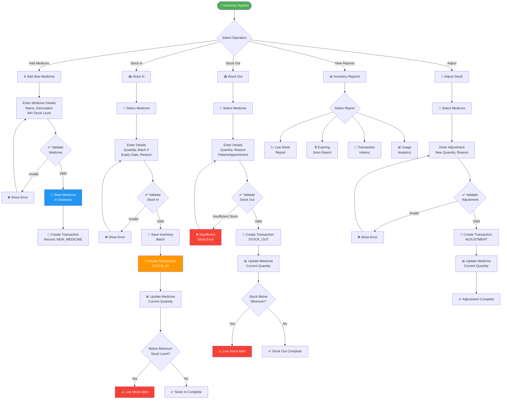

---

## 9. Medical Records Flow

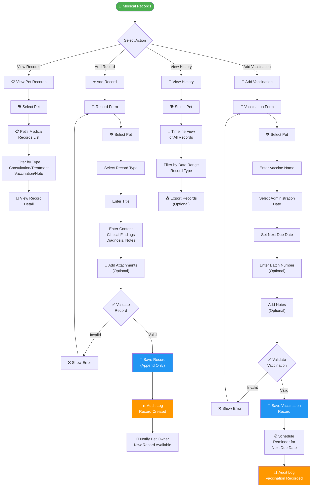

---

## 10. OCR/Scanning Workflow

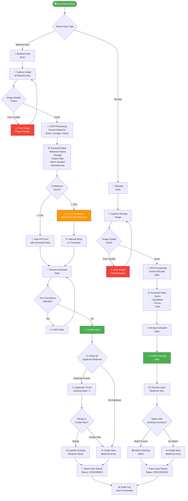

---

## 11. Notification Flow

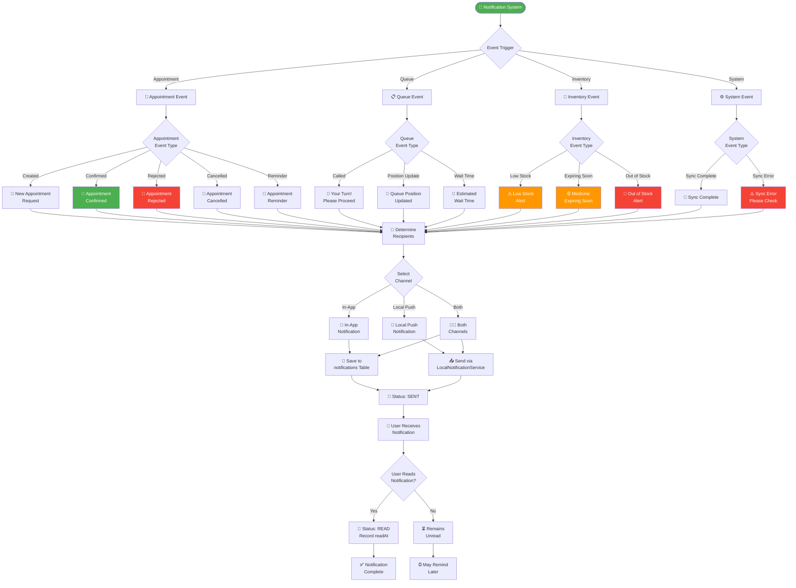

---

## 12. Data Synchronization Flow

```mermaid
flowchart TD
    START([🔄 Sync System]) --> INIT_SYNC["Initialize Sync\nController"]

    INIT_SYNC --> AUTH_SYNC["🔐 Auth Sync Service\nStarted"]

    AUTH_SYNC --> CHECK_LOCAL_USERS["📋 Check Local\nUsers Table"]

    CHECK_LOCAL_USERS --> LOCAL_USERS{"Local Users\nWithout Firebase UID?"}

    LOCAL_USERS -->|Yes| FOR_EACH_USER["🔄 For Each\nUnsynced User"]

    FOR_EACH_USER --> CREATE_FIREBASE["☁️ Create Firebase\nAuth Account"]
    CREATE_FIREBASE --> FIREBASE_RESULT{"Firebase\nCreation Result"}

    FIREBASE_RESULT -->|Success| SAVE_FIRESTORE["📄 Save User Data\nto Firestore\nusers Collection"]
    FIREBASE_RESULT -->|Email Exists| CHECK_FIRESTORE["🔍 Query Firestore\nfor Existing User\nby Email"]
    FIREBASE_RESULT -->|Error| LOG_ERROR["⚠️ Log Error\nSkip User"]

    CHECK_FIRESTORE --> FIRESTORE_FOUND{"User Found\nin Firestore?"}
    FIRESTORE_FOUND -->|Yes| UPDATE_LOCAL_UID["📝 Update Local DB\nwith Firebase UID"]
    FIRESTORE_FOUND -->|No| SKIP_USER["⏭️ Skip User"]

    SAVE_FIRESTORE --> UPDATE_LOCAL_UID
    LOG_ERROR --> NEXT_USER["⏭️ Next Unsynced\nUser"]
    SKIP_USER --> NEXT_USER

    UPDATE_LOCAL_UID --> NEXT_USER

    NEXT_USER --> MORE_USERS{"More Unsynced\nUsers?"}
    MORE_USERS -->|Yes| FOR_EACH_USER
    MORE_USERS -->|No| AUTH_SYNC_COMPLETE["✅ Auth Sync\nComplete"]

    LOCAL_USERS -->|No| AUTH_SYNC_COMPLETE

    AUTH_SYNC_COMPLETE --> DATA_SYNC["📊 Data Sync\n(Bi-directional)"]

    DATA_SYNC --> CHECK_METADATA["🔍 Check\nSyncMetadata\nTable"]
    CHECK_METADATA --> LAST_SYNC["Get Last Sync\nTimestamp"]

    LAST_SYNC --> PENDING_CHANGES{"Pending Local\nChanges?"}

    PENDING_CHANGES -->|Yes| UPLOAD_CHANGES["📤 Upload Changes\nto Firestore"]
    UPLOAD_CHANGES --> CONFLICT_CHECK{"Conflict\nDetected?"}

    CONFLICT_CHECK -->|No Conflict| APPLY_REMOTE["📥 Apply Remote\nChanges Locally"]
    CONFLICT_CHECK -->|Conflict| RESOLVE_CONFLICT["⚖️ Resolve Conflict\n(Last Write Wins)"]
    RESOLVE_CONFLICT --> APPLY_REMOTE

    PENDING_CHANGES -->|No| APPLY_REMOTE

    APPLY_REMOTE --> UPDATE_SYNC_META["📝 Update\nSyncMetadata\nTimestamp"]
    UPDATE_SYNC_META --> SYNC_COMPLETE["✅ Sync Cycle\nComplete"]

    SYNC_COMPLETE --> WAIT_INTERVAL["⏳ Wait 15 Minutes\n(WiFi Only)"]
    WAIT_INTERVAL --> DATA_SYNC

    style START fill:#4CAF50,color:#fff
    style AUTH_SYNC_COMPLETE fill:#4CAF50,color:#fff
    style SYNC_COMPLETE fill:#4CAF50,color:#fff
    style LOG_ERROR fill:#f44336,color:#fff
    style CONFLICT_CHECK fill:#FF9800,color:#fff
```

---

## Appendix: Legend

| Symbol | Meaning |
|--------|---------|
| 🟢 Green | Start/End/Success |
| 🔵 Blue | Primary Action |
| 🟠 Orange | Warning/Decision |
| 🔴 Red | Error/Failure |
| ⬜ Gray | Idle/Complete |

---

*Generated as part of CarePaw thesis project - System Flowcharts Documentation*
