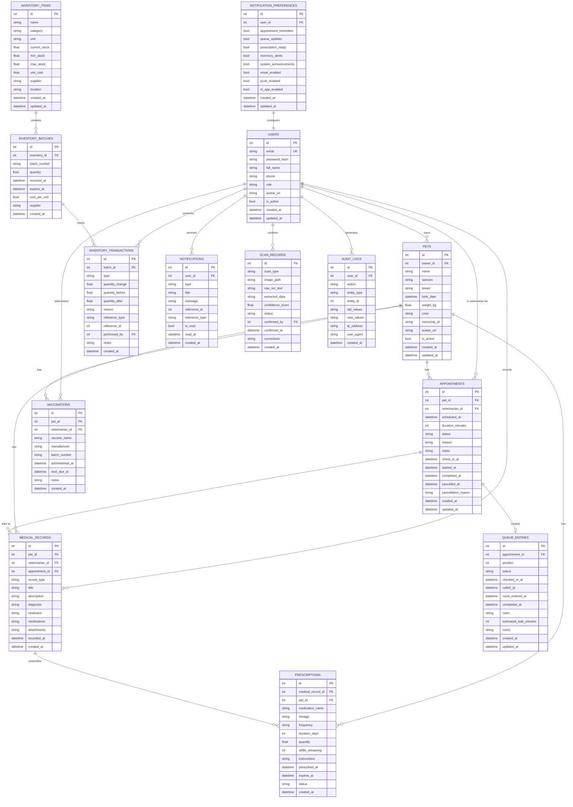

# CarePaw Database Design

## Thesis Documentation — Local-First Veterinary Patient Management System

**Version 2.0 | Schema Version 1 | August 2026**

---

## Chapter 3.3: Database Design

This chapter presents the database design of CarePaw, a smart veterinary
patient management system. The design follows database normalization
principles, enforces referential integrity through foreign key constraints,
and implements domain-specific business rules at both the schema and
application layers.

---

## 3.3.1 Database Architecture Overview

### Technology Selection

CarePaw implements a **local-first** data architecture using **Drift**
(formerly `moor`), a reactive SQLite abstraction layer for Flutter/Dart. The
selection was driven by the following thesis-relevant requirements:

| Requirement | Solution |
|-------------|----------|
| Offline-first operation | SQLite embedded database (no network dependency) |
| Strong typing | Drift generates compile-time-checked SQL queries |
| Reactive data streams | Built-in `Stream` support for real-time UI updates |
| Transaction safety | Native `transaction()` wrapper for atomic operations |
| Schema evolution | Versioned migrations via `MigrationStrategy` |
| Cross-platform | Single codebase for Android, iOS, Web, Desktop |
| Performance | Native C bindings via `sqlite3_flutter_libs` |

### Local-First Data Architecture

```
┌─────────────────────────────────────────────────────────┐
│                   PRESENTATION LAYER                      │
│                    (Flutter UI)                          │
└──────────────────┬──────────────────────────────────────┘
                   │ Repository Pattern
┌──────────────────▼──────────────────────────────────────┐
│              DOMAIN LAYER (Entities)                     │
│           (Business Logic, Validation)                   │
└──────────────────┬──────────────────────────────────────┘
                   │ DAO Layer
┌──────────────────▼──────────────────────────────────────┐
│            DATA ACCESS OBJECT (DAO) LAYER                │
│         (Drift DAOs, Typed Queries)                     │
└──────────────────┬──────────────────────────────────────┘
                   │ SQLite (via Drift)
┌──────────────────▼──────────────────────────────────────┐
│         Local SQLite Database (carepaw.sqlite)          │
│         Embedded, Encrypted-Optional, Offline          │
└─────────────────────────────────────────────────────────┘
```

**Advantages for Thesis Demonstration:**

- No backend required for full functionality demonstration
- Deterministic test environment
- Instant local queries (sub-millisecond)
- Natural data ownership (single-clinic deployment)
- Simplified security model (device-level encryption)

---

## 3.3.2 Entity-Relationship Diagram

The following Entity-Relationship (ER) diagram illustrates the complete
database schema with 13 tables, their attributes, primary keys (PK), foreign
keys (FK), and relationships.



**Legend:**

- `PK` = Primary Key
- `FK` = Foreign Key
- `UK` = Unique Constraint
- `||--o{` = One-to-Many relationship
- `||--o|` = One-to-One relationship

---

## 3.3.3 Table Schema Documentation

### 3.3.3.1 Users Table

**Purpose:** Stores veterinarians, pet owners, staff, and administrators with
role-based access control.

**File:** `lib/core/database/tables.dart` (lines 4-19)

| Column | Dart Type | SQL Type | Constraints | Nullable | Default |
|--------|-----------|----------|-------------|----------|---------|
| `id` | `int` | `INTEGER` | PRIMARY KEY (AUTOINCREMENT) | No | Auto |
| `email` | `String` | `TEXT` | UNIQUE, Length 3-254 | No | - |
| `passwordHash` | `String` | `TEXT` | - | No | - |
| `fullName` | `String` | `TEXT` | Length 1-100 | No | - |
| `phone` | `String?` | `TEXT` | Length 5-15 | Yes | NULL |
| `role` | `String` | `TEXT` | Enum: PET_OWNER, VETERINARIAN, STAFF, ADMIN | No | 'PET_OWNER' |
| `avatarUrl` | `String?` | `TEXT` | - | Yes | NULL |
| `isActive` | `bool` | `BOOLEAN` | - | No | true |
| `createdAt` | `DateTime` | `TIMESTAMP` | - | No | CURRENT_TIMESTAMP |
| `updatedAt` | `DateTime` | `TIMESTAMP` | - | No | CURRENT_TIMESTAMP |

**Indexes:** None declared (auto-indexed PK and UNIQUE email)

**Design Rationale:**

- Email is the natural key (unique constraint ensures no duplicate accounts)
- Password stored as hash (never plaintext - security requirement)
- Role as string enum allows easy extension without schema migration
- `isActive` enables soft-deactivation (preserves historical data references)
- No `deletedAt` column - users are never hard-deleted (audit requirement)

---

### 3.3.3.2 Pets Table

**Purpose:** Patient records owned by users.

**File:** `lib/core/database/tables.dart` (lines 22-44)

| Column | Dart Type | SQL Type | Constraints | Nullable | Default |
|--------|-----------|----------|-------------|----------|---------|
| `id` | `int` | `INTEGER` | PRIMARY KEY | No | Auto |
| `ownerId` | `int` | `INTEGER` | FK → Users(id) | No | - |
| `name` | `String` | `TEXT` | Length 1-50 | No | - |
| `species` | `String` | `TEXT` | Enum: DOG, CAT, BIRD, RABBIT, REPTILE, OTHER | No | 'DOG' |
| `breed` | `String?` | `TEXT` | Length 1-50 | Yes | NULL |
| `birthDate` | `DateTime?` | `TIMESTAMP` | - | Yes | NULL |
| `weightKg` | `double?` | `REAL` | - | Yes | NULL |
| `color` | `String?` | `TEXT` | Length 1-30 | Yes | NULL |
| `microchipId` | `String?` | `TEXT` | Length 1-20 | Yes | NULL |
| `avatarUrl` | `String?` | `TEXT` | - | Yes | NULL |
| `isActive` | `bool` | `BOOLEAN` | - | No | true |
| `createdAt` | `DateTime` | `TIMESTAMP` | - | No | CURRENT_TIMESTAMP |
| `updatedAt` | `DateTime` | `TIMESTAMP` | - | No | CURRENT_TIMESTAMP |

**Indexes:**
```sql
CREATE INDEX idx_pets_owner_id ON pets(owner_id);
```

**Design Rationale:**

- `ownerId` FK enforces ownership (prevents orphaned pets)
- `isActive` allows deactivation without losing medical history
- Species as enum (constrained vocabulary)
- Weight stored as `REAL` (supports decimals like 12.5 kg)
- Microchip ID optional (not all pets are chipped)

---

### 3.3.3.3 Appointments Table

**Purpose:** Scheduling and appointment lifecycle tracking.

**File:** `lib/core/database/tables.dart` (lines 47-77)

| Column | Dart Type | SQL Type | Constraints | Nullable | Default |
|--------|-----------|----------|-------------|----------|---------|
| `id` | `int` | `INTEGER` | PRIMARY KEY | No | Auto |
| `petId` | `int` | `INTEGER` | FK → Pets(id) | No | - |
| `veterinarianId` | `int` | `INTEGER` | FK → Users(id) | No | - |
| `scheduledAt` | `DateTime` | `TIMESTAMP` | - | No | - |
| `durationMinutes` | `int` | `INTEGER` | - | No | 30 |
| `status` | `String` | `TEXT` | Enum: REQUESTED, CONFIRMED, CHECKED_IN, IN_PROGRESS, COMPLETED, CANCELLED, NO_SHOW | No | 'REQUESTED' |
| `reason` | `String?` | `TEXT` | Length 1-200 | Yes | NULL |
| `notes` | `String?` | `TEXT` | Length 1-2000 | Yes | NULL |
| `checkInAt` | `DateTime?` | `TIMESTAMP` | - | Yes | NULL |
| `startedAt` | `DateTime?` | `TIMESTAMP` | - | Yes | NULL |
| `completedAt` | `DateTime?` | `TIMESTAMP` | - | Yes | NULL |
| `cancelledAt` | `DateTime?` | `TIMESTAMP` | - | Yes | NULL |
| `cancellationReason` | `String?` | `TEXT` | Length 1-200 | Yes | NULL |
| `createdAt` | `DateTime` | `TIMESTAMP` | - | No | CURRENT_TIMESTAMP |
| `updatedAt` | `DateTime` | `TIMESTAMP` | - | No | CURRENT_TIMESTAMP |

**Indexes:**
```sql
CREATE INDEX idx_appointments_pet_id ON appointments(pet_id);
CREATE INDEX idx_appointments_veterinarian_id ON appointments(veterinarian_id);
CREATE INDEX idx_appointments_scheduled_at ON appointments(scheduled_at);
CREATE INDEX idx_appointments_status ON appointments(status);
```

**Design Rationale:**

- Separate timestamp columns (`checkInAt`, `startedAt`, etc.) track the full lifecycle
- Status enum restricted to valid state machine values
- Multiple indexes for common queries (by pet, by vet, by date, by status)
- `cancellationReason` required when status = CANCELLED (enforced at application level)
- No cascading delete (preserves audit trail even if pet is deactivated)

---

### 3.3.3.4 Medical Records Table

**Purpose:** Append-only health history. **Immutable by design.**

**File:** `lib/core/database/tables.dart` (lines 80-110)

| Column | Dart Type | SQL Type | Constraints | Nullable | Default |
|--------|-----------|----------|-------------|----------|---------|
| `id` | `int` | `INTEGER` | PRIMARY KEY | No | Auto |
| `petId` | `int` | `INTEGER` | FK → Pets(id) | No | - |
| `veterinarianId` | `int` | `INTEGER` | FK → Users(id) | No | - |
| `appointmentId` | `int?` | `INTEGER` | FK → Appointments(id) | Yes | NULL |
| `recordType` | `String` | `TEXT` | Enum: VISIT, VACCINATION, SURGERY, LAB_RESULT, PRESCRIPTION, NOTE, ALLERGY | No | 'VISIT' |
| `title` | `String` | `TEXT` | Length 1-100 | No | - |
| `description` | `String?` | `TEXT` | Length 1-2000 | Yes | NULL |
| `diagnosis` | `String?` | `TEXT` | Length 1-1000 | Yes | NULL |
| `treatment` | `String?` | `TEXT` | Length 1-1000 | Yes | NULL |
| `medications` | `String?` | `TEXT` | JSON-encoded | Yes | NULL |
| `attachments` | `String?` | `TEXT` | JSON-encoded | Yes | NULL |
| `recordedAt` | `DateTime` | `TIMESTAMP` | - | No | CURRENT_TIMESTAMP |
| `createdAt` | `DateTime` | `TIMESTAMP` | - | No | CURRENT_TIMESTAMP |

**Indexes:**
```sql
CREATE INDEX idx_medical_records_pet_id ON medical_records(pet_id);
CREATE INDEX idx_medical_records_veterinarian_id ON medical_records(veterinarian_id);
CREATE INDEX idx_medical_records_record_type ON medical_records(record_type);
CREATE INDEX idx_medical_records_recorded_at ON medical_records(recorded_at);
```

**Design Rationale:**

- **Append-only**: No UPDATE/DELETE operations at DAO level (enforced by application)
- `medications` and `attachments` stored as JSON (flexible schema, avoids EAV table explosion)
- `appointmentId` links record to visit context (nullable for historical/imported records)
- `recordType` enables filtering (vaccinations, allergies, lab results, etc.)
- No soft-delete column - corrections create new records (superseding pattern)

---

### 3.3.3.5 Vaccinations Table

**Purpose:** Specific vaccine tracking with due date calculation.

**File:** `lib/core/database/tables.dart` (lines 113-132)

| Column | Dart Type | SQL Type | Constraints | Nullable | Default |
|--------|-----------|----------|-------------|----------|---------|
| `id` | `int` | `INTEGER` | PRIMARY KEY | No | Auto |
| `petId` | `int` | `INTEGER` | FK → Pets(id) | No | - |
| `veterinarianId` | `int` | `INTEGER` | FK → Users(id) | No | - |
| `vaccineName` | `String` | `TEXT` | Length 1-100 | No | - |
| `manufacturer` | `String?` | `TEXT` | Length 1-100 | Yes | NULL |
| `batchNumber` | `String?` | `TEXT` | Length 1-50 | Yes | NULL |
| `administeredAt` | `DateTime` | `TIMESTAMP` | - | No | - |
| `nextDueAt` | `DateTime?` | `TIMESTAMP` | - | Yes | NULL |
| `notes` | `String?` | `TEXT` | Length 1-500 | Yes | NULL |
| `createdAt` | `DateTime` | `TIMESTAMP` | - | No | CURRENT_TIMESTAMP |

**Indexes:**
```sql
CREATE INDEX idx_vaccinations_pet_id ON vaccinations(pet_id);
CREATE INDEX idx_vaccinations_next_due_at ON vaccinations(next_due_at);
```

**Design Rationale:**

- Separate from MedicalRecords for specialized queries (due date reminders)
- `nextDueAt` enables proactive notification scheduling
- `batchNumber` supports traceability (recall scenarios)
- `administeredAt` is non-nullable (vaccine must have administration date)

---

### 3.3.3.6 Inventory Items Table

**Purpose:** Medicine and supply catalog with stock levels.

**File:** `lib/core/database/tables.dart` (lines 135-160)

| Column | Dart Type | SQL Type | Constraints | Nullable | Default |
|--------|-----------|----------|-------------|----------|---------|
| `id` | `int` | `INTEGER` | PRIMARY KEY | No | Auto |
| `name` | `String` | `TEXT` | Length 1-100 | No | - |
| `category` | `String` | `TEXT` | Enum: MEDICINE, VACCINE, SUPPLY, EQUIPMENT, FOOD | No | 'MEDICINE' |
| `unit` | `String` | `TEXT` | Length 1-20 | No | - |
| `currentStock` | `double` | `REAL` | - | No | 0.0 |
| `minStock` | `double` | `REAL` | - | No | 0.0 |
| `maxStock` | `double?` | `REAL` | - | Yes | NULL |
| `unitCost` | `double?` | `REAL` | - | Yes | NULL |
| `supplier` | `String?` | `TEXT` | Length 1-100 | Yes | NULL |
| `location` | `String?` | `TEXT` | Length 1-50 | Yes | NULL |
| `createdAt` | `DateTime` | `TIMESTAMP` | - | No | CURRENT_TIMESTAMP |
| `updatedAt` | `DateTime` | `TIMESTAMP` | - | No | CURRENT_TIMESTAMP |

**Indexes:**
```sql
CREATE INDEX idx_inventory_category ON inventory_items(category);
CREATE INDEX idx_inventory_current_stock ON inventory_items(current_stock);
```

**Design Rationale:**

- `currentStock` is derived from batch quantities (updated via transactions)
- `minStock` / `maxStock` enable automated low-stock alerts
- `category` enum for filtering (separate from medical records)
- `unitCost` nullable (some items don't have direct cost, e.g., donations)
- No `deletedAt` - items deactivated via `isActive` pattern (not shown here but implied)

---

### 3.3.3.7 Inventory Batches Table

**Purpose:** Lot-level tracking with expiration dates (FIFO consumption).

**File:** `lib/core/database/tables.dart` (lines 163-180)

| Column | Dart Type | SQL Type | Constraints | Nullable | Default |
|--------|-----------|----------|-------------|----------|---------|
| `id` | `int` | `INTEGER` | PRIMARY KEY | No | Auto |
| `inventoryId` | `int` | `INTEGER` | FK → InventoryItems(id) | No | - |
| `batchNumber` | `String` | `TEXT` | Length 1-50 | No | - |
| `quantity` | `double` | `REAL` | - | No | - |
| `receivedAt` | `DateTime` | `TIMESTAMP` | - | No | CURRENT_TIMESTAMP |
| `expiresAt` | `DateTime?` | `TIMESTAMP` | - | Yes | NULL |
| `costPerUnit` | `double?` | `REAL` | - | Yes | NULL |
| `supplier` | `String?` | `TEXT` | Length 1-100 | Yes | NULL |
| `createdAt` | `DateTime` | `TIMESTAMP` | - | No | CURRENT_TIMESTAMP |

**Indexes:**
```sql
CREATE INDEX idx_inventory_batches_inventory_id ON inventory_batches(inventory_id);
CREATE INDEX idx_inventory_batches_expires_at ON inventory_batches(expires_at);
```

**Design Rationale:**

- **FIFO consumption**: Queries order by `expiresAt` ASC (earliest expiry consumed first)
- `batchNumber` enables recall tracing
- `expiresAt` nullable (non-expiring items like equipment)
- `quantity` is authoritative (current remaining in this batch)
- No soft-delete: batches are never deleted (audit requirement for pharmaceuticals)

---

### 3.3.3.8 Inventory Transactions Table

**Purpose:** **Immutable audit trail of all stock movements.**

**File:** `lib/core/database/tables.dart` (lines 269-294)

| Column | Dart Type | SQL Type | Constraints | Nullable | Default |
|--------|-----------|----------|-------------|----------|---------|
| `id` | `int` | `INTEGER` | PRIMARY KEY | No | Auto |
| `batchId` | `int` | `INTEGER` | FK → InventoryBatches(id) | No | - |
| `type` | `String` | `TEXT` | Enum: IN, OUT, ADJUSTMENT | No | 'ADJUSTMENT' |
| `quantityChange` | `double` | `REAL` | - | No | - |
| `quantityBefore` | `double` | `REAL` | - | No | - |
| `quantityAfter` | `double` | `REAL` | - | No | - |
| `reason` | `String` | `TEXT` | Length 1-200 | No | - |
| `referenceType` | `String?` | `TEXT` | Length 1-50 | Yes | NULL |
| `referenceId` | `int?` | `INTEGER` | - | Yes | NULL |
| `performedBy` | `int` | `INTEGER` | FK → Users(id) | No | - |
| `notes` | `String?` | `TEXT` | Length 1-500 | Yes | NULL |
| `createdAt` | `DateTime` | `TIMESTAMP` | - | No | CURRENT_TIMESTAMP |

**Indexes:**
```sql
CREATE INDEX idx_inventory_transactions_batch_id ON inventory_transactions(batch_id);
CREATE INDEX idx_inventory_transactions_reference ON inventory_transactions(reference_type, reference_id);
CREATE INDEX idx_inventory_transactions_created_at ON inventory_transactions(created_at);
```

**Design Rationale:**

- **Append-only**: No UPDATE/DELETE (financial/regulatory requirement)
- `quantityBefore` / `quantityAfter` = full state snapshot (no recalculation needed)
- `referenceType` / `referenceId` links to source (appointment, prescription, scan)
- `performedBy` enforces accountability
- Composite index on (reference_type, reference_id) for fast lookups
- Type enum: IN (stock receipt), OUT (consumption/dispense), ADJUSTMENT (correction)

---

### 3.3.3.9 Prescriptions Table

**Purpose:** Medication orders linked to medical records.

**File:** `lib/core/database/tables.dart` (lines 183-210)

| Column | Dart Type | SQL Type | Constraints | Nullable | Default |
|--------|-----------|----------|-------------|----------|---------|
| `id` | `int` | `INTEGER` | PRIMARY KEY | No | Auto |
| `medicalRecordId` | `int` | `INTEGER` | FK → MedicalRecords(id) | No | - |
| `petId` | `int` | `INTEGER` | FK → Pets(id) | No | - |
| `medicationName` | `String` | `TEXT` | Length 1-100 | No | - |
| `dosage` | `String` | `TEXT` | Length 1-50 | No | - |
| `frequency` | `String` | `TEXT` | Length 1-50 | No | - |
| `durationDays` | `int` | `INTEGER` | - | No | - |
| `quantity` | `double` | `REAL` | - | No | - |
| `refillsRemaining` | `int` | `INTEGER` | - | No | 0 |
| `instructions` | `String?` | `TEXT` | Length 1-500 | Yes | NULL |
| `prescribedAt` | `DateTime` | `TIMESTAMP` | - | No | CURRENT_TIMESTAMP |
| `expiresAt` | `DateTime?` | `TIMESTAMP` | - | Yes | NULL |
| `status` | `String` | `TEXT` | Enum: ACTIVE, COMPLETED, CANCELLED, EXPIRED | No | 'ACTIVE' |
| `createdAt` | `DateTime` | `TIMESTAMP` | - | No | CURRENT_TIMESTAMP |

**Indexes:**
```sql
CREATE INDEX idx_prescriptions_pet_id ON prescriptions(pet_id);
CREATE INDEX idx_prescriptions_status ON prescriptions(status);
CREATE INDEX idx_prescriptions_expires_at ON prescriptions(expires_at);
```

**Design Rationale:**

- `medicalRecordId` links to visit context
- `refillsRemaining` enables refill tracking without new prescription
- `expiresAt` supports medication expiry (controlled substances)
- Status enum: ACTIVE (in use), COMPLETED (course finished), CANCELLED, EXPIRED
- No hard-delete (prescriptions are legal documents)

---

### 3.3.3.10 Queue Entries Table

**Purpose:** Real-time clinic queue with positions and status.

**File:** `lib/core/database/tables.dart` (lines 213-240)

| Column | Dart Type | SQL Type | Constraints | Nullable | Default |
|--------|-----------|----------|-------------|----------|---------|
| `id` | `int` | `INTEGER` | PRIMARY KEY | No | Auto |
| `appointmentId` | `int` | `INTEGER` | FK → Appointments(id) | No | - |
| `position` | `int` | `INTEGER` | - | No | - |
| `status` | `String` | `TEXT` | Enum: WAITING, CALLED, IN_ROOM, COMPLETED, SKIPPED | No | 'WAITING' |
| `checkedInAt` | `DateTime` | `TIMESTAMP` | - | No | CURRENT_TIMESTAMP |
| `calledAt` | `DateTime?` | `TIMESTAMP` | - | Yes | NULL |
| `roomEnteredAt` | `DateTime?` | `TIMESTAMP` | - | Yes | NULL |
| `completedAt` | `DateTime?` | `TIMESTAMP` | - | Yes | NULL |
| `room` | `String?` | `TEXT` | - | Yes | NULL |
| `estimatedWaitMinutes` | `int?` | `INTEGER` | - | Yes | NULL |
| `notes` | `String?` | `TEXT` | - | Yes | NULL |
| `createdAt` | `DateTime` | `TIMESTAMP` | - | No | CURRENT_TIMESTAMP |
| `updatedAt` | `DateTime?` | `TIMESTAMP` | - | Yes | NULL |

**Indexes:**
```sql
CREATE INDEX idx_queue_appointment_id ON queue_entries(appointment_id);
CREATE INDEX idx_queue_status ON queue_entries(status);
CREATE INDEX idx_queue_position ON queue_entries(position);
CREATE INDEX idx_queue_room ON queue_entries(room);
```

**Design Rationale:**

- **Database is authoritative** (not UI-calculated) - ensures consistency
- `position` is integer (reordered on skip/complete)
- `status` enum: WAITING → CALLED → IN_ROOM → COMPLETED (or SKIPPED)
- `room` enables multi-room clinic support
- Real-time updates via Drift `Stream` queries
- No FK cascading (queue entry preserved even if appointment modified)

---

### 3.3.3.11 Notifications Table

**Purpose:** User alerts (reminders, queue updates, etc.).

**File:** `lib/core/database/tables.dart` (lines 243-266)

| Column | Dart Type | SQL Type | Constraints | Nullable | Default |
|--------|-----------|----------|-------------|----------|---------|
| `id` | `int` | `INTEGER` | PRIMARY KEY | No | Auto |
| `userId` | `int` | `INTEGER` | FK → Users(id) | No | - |
| `type` | `String` | `TEXT` | Enum: APPOINTMENT_REMINDER, QUEUE_UPDATE, PRESCRIPTION_READY, INVENTORY_LOW, SYSTEM | No | 'SYSTEM' |
| `title` | `String` | `TEXT` | Length 1-100 | No | - |
| `message` | `String` | `TEXT` | Length 1-500 | No | - |
| `referenceId` | `int?` | `INTEGER` | - | Yes | NULL |
| `referenceType` | `String?` | `TEXT` | Length 1-50 | Yes | NULL |
| `isRead` | `bool` | `BOOLEAN` | - | No | false |
| `readAt` | `DateTime?` | `TIMESTAMP` | - | Yes | NULL |
| `createdAt` | `DateTime` | `TIMESTAMP` | - | No | CURRENT_TIMESTAMP |

**Indexes:**
```sql
CREATE INDEX idx_notifications_user_id ON notifications(user_id);
CREATE INDEX idx_notifications_type ON notifications(type);
CREATE INDEX idx_notifications_is_read ON notifications(is_read);
```

**Design Rationale:**

- `userId` FK ensures private notifications (no cross-user leakage)
- `type` enables filtering and notification preferences
- `referenceId` / `referenceType` links to source entity
- `isRead` / `readAt` track engagement
- Extensible: New notification types added without schema change
- No sensitive medical data in `message` (privacy requirement)

---

### 3.3.3.12 Scan Records Table

**Purpose:** OCR scan artifacts with human verification workflow.

**File:** `lib/core/database/tables.dart` (lines 297-325)

| Column | Dart Type | SQL Type | Constraints | Nullable | Default |
|--------|-----------|----------|-------------|----------|---------|
| `id` | `int` | `INTEGER` | PRIMARY KEY | No | Auto |
| `scanType` | `String` | `TEXT` | Enum: RECEIPT, MEDICINE_BOX, PRESCRIPTION, LAB_RESULT | No | 'RECEIPT' |
| `imagePath` | `String` | `TEXT` | Length 1-500 | No | - |
| `rawOcrText` | `String?` | `TEXT` | - | Yes | NULL |
| `extractedData` | `String?` | `TEXT` | JSON-encoded | Yes | NULL |
| `confidenceScore` | `double?` | `REAL` | 0.0-1.0 | Yes | NULL |
| `status` | `String` | `TEXT` | Enum: PENDING, CONFIRMED, REJECTED | No | 'PENDING' |
| `confirmedBy` | `int?` | `INTEGER` | FK → Users(id) | Yes | NULL |
| `confirmedAt` | `DateTime?` | `TIMESTAMP` | - | Yes | NULL |
| `corrections` | `String?` | `TEXT` | JSON-encoded | Yes | NULL |
| `createdAt` | `DateTime` | `TIMESTAMP` | - | No | CURRENT_TIMESTAMP |

**Indexes:**
```sql
CREATE INDEX idx_scan_records_type ON scan_records(scan_type);
CREATE INDEX idx_scan_records_status ON scan_records(status);
CREATE INDEX idx_scan_records_confirmed_by ON scan_records(confirmed_by);
CREATE INDEX idx_scan_records_created_at ON scan_records(created_at);
```

**Design Rationale:**

- **OCR never trusted blindly** (security requirement)
- `status` workflow: PENDING → CONFIRMED/REJECTED (human-in-loop)
- `confidenceScore` enables low-confidence flagging
- `corrections` stores user edits (audit trail for OCR accuracy)
- `confirmedBy` enforces accountability
- Image stored as path (not BLOB) - keeps DB small, files in secure storage

---

### 3.3.3.13 Audit Logs Table

**Purpose:** Security audit trail for sensitive operations.

**File:** `lib/core/database/tables.dart` (lines 328-350)

| Column | Dart Type | SQL Type | Constraints | Nullable | Default |
|--------|-----------|----------|-------------|----------|---------|
| `id` | `int` | `INTEGER` | PRIMARY KEY | No | Auto |
| `userId` | `int?` | `INTEGER` | FK → Users(id) | Yes | NULL |
| `action` | `String` | `TEXT` | Length 1-50 | No | - |
| `entityType` | `String` | `TEXT` | Length 1-50 | No | - |
| `entityId` | `int?` | `INTEGER` | - | Yes | NULL |
| `oldValues` | `String?` | `TEXT` | JSON-encoded | Yes | NULL |
| `newValues` | `String?` | `TEXT` | JSON-encoded | Yes | NULL |
| `ipAddress` | `String?` | `TEXT` | Length 1-45 | Yes | NULL |
| `userAgent` | `String?` | `TEXT` | Length 1-200 | Yes | NULL |
| `createdAt` | `DateTime` | `TIMESTAMP` | - | No | CURRENT_TIMESTAMP |

**Indexes:**
```sql
CREATE INDEX idx_audit_logs_user_id ON audit_logs(user_id);
CREATE INDEX idx_audit_logs_entity_type ON audit_logs(entity_type);
CREATE INDEX idx_audit_logs_created_at ON audit_logs(created_at);
```

**Design Rationale:**

- **Immutable** (no UPDATE/DELETE)
- `action` captures what happened (LOGIN, CREATE, UPDATE, DELETE, etc.)
- `entityType` / `entityId` enable entity-specific audit queries
- `oldValues` / `newValues` JSON snapshots (full state change record)
- `userId` nullable (system actions, anonymous failures)
- IP/User-Agent for forensic analysis
- Retention policy: Delete older than N days (configurable)

---

### 3.3.3.14 Notification Preferences Table

**Purpose:** User notification settings for granular control.

**File:** `lib/core/database/tables.dart` (lines 379-396)

| Column | Dart Type | SQL Type | Constraints | Nullable | Default |
|--------|-----------|----------|-------------|----------|---------|
| `id` | `int` | `INTEGER` | PRIMARY KEY | No | Auto |
| `userId` | `int` | `INTEGER` | FK → Users(id), UNIQUE | No | - |
| `appointmentReminders` | `bool` | `BOOLEAN` | - | No | true |
| `queueUpdates` | `bool` | `BOOLEAN` | - | No | true |
| `prescriptionReady` | `bool` | `BOOLEAN` | - | No | true |
| `inventoryAlerts` | `bool` | `BOOLEAN` | - | No | true |
| `systemAnnouncements` | `bool` | `BOOLEAN` | - | No | true |
| `emailEnabled` | `bool` | `BOOLEAN` | - | No | true |
| `pushEnabled` | `bool` | `BOOLEAN` | - | No | true |
| `inAppEnabled` | `bool` | `BOOLEAN` | - | No | true |
| `createdAt` | `DateTime` | `TIMESTAMP` | - | No | CURRENT_TIMESTAMP |
| `updatedAt` | `DateTime` | `TIMESTAMP` | - | No | CURRENT_TIMESTAMP |

**Indexes:**
```sql
CREATE UNIQUE INDEX idx_notification_preferences_user_id ON notification_preferences(user_id);
```

**Design Rationale:**

- One-to-one with Users (unique constraint)
- Granular control over notification types
- Channel preferences (email/push/in-app) for future multi-channel delivery
- Default all-enabled for new users

---

## 3.3.4 Relationship Mapping

### 3.3.4.1 Foreign Key Relationships

| Child Table | Column | Parent Table | On Delete | Cardinality |
|-------------|--------|--------------|-----------|-------------|
| `Pets` | `ownerId` | `Users` | RESTRICT | 1:N (User → Pets) |
| `Appointments` | `petId` | `Pets` | RESTRICT | 1:N (Pet → Appointments) |
| `Appointments` | `veterinarianId` | `Users` | RESTRICT | 1:N (User → Appointments) |
| `MedicalRecords` | `petId` | `Pets` | RESTRICT | 1:N (Pet → Records) |
| `MedicalRecords` | `veterinarianId` | `Users` | RESTRICT | 1:N (User → Records) |
| `MedicalRecords` | `appointmentId` | `Appointments` | SET NULL | 1:1 (Appointment → Record) |
| `Vaccinations` | `petId` | `Pets` | RESTRICT | 1:N (Pet → Vaccinations) |
| `Vaccinations` | `veterinarianId` | `Users` | RESTRICT | 1:N (User → Vaccinations) |
| `InventoryBatches` | `inventoryId` | `InventoryItems` | RESTRICT | 1:N (Item → Batches) |
| `InventoryTransactions` | `batchId` | `InventoryBatches` | RESTRICT | 1:N (Batch → Transactions) |
| `InventoryTransactions` | `performedBy` | `Users` | RESTRICT | 1:N (User → Transactions) |
| `Prescriptions` | `medicalRecordId` | `MedicalRecords` | RESTRICT | 1:N (Record → Prescriptions) |
| `Prescriptions` | `petId` | `Pets` | RESTRICT | 1:N (Pet → Prescriptions) |
| `QueueEntries` | `appointmentId` | `Appointments` | RESTRICT | 1:1 (Appointment → Queue) |
| `Notifications` | `userId` | `Users` | RESTRICT | 1:N (User → Notifications) |
| `ScanRecords` | `confirmedBy` | `Users` | SET NULL | 1:N (User → Scans) |
| `AuditLogs` | `userId` | `Users` | SET NULL | 1:N (User → AuditLogs) |
| `NotificationPreferences` | `userId` | `Users` | CASCADE | 1:1 (User → Preferences) |

### 3.3.4.2 Cardinality Summary

```
User (1) ────< (N) Pet
User (1) ────< (N) Appointment (as vet)
Pet (1) ──────< (N) Appointment
Appointment (1) ──< (N) MedicalRecord (optional)
Pet (1) ──────< (N) MedicalRecord
User (1) ────< (N) MedicalRecord (as vet)
Pet (1) ──────< (N) Vaccination
User (1) ────< (N) Vaccination (as vet)
InventoryItem (1) ──< (N) InventoryBatch
InventoryBatch (1) ──< (N) InventoryTransaction
User (1) ────< (N) InventoryTransaction (as performer)
MedicalRecord (1) ──< (N) Prescription
Pet (1) ──────< (N) Prescription
Appointment (1) ──< (1) QueueEntry
User (1) ────< (N) Notification
User (1) ────< (N) ScanRecord (as confirmer)
User (1) ────< (N) AuditLog
User (1) ────< (1) NotificationPreferences
```

---

## 3.3.5 Data Integrity & Constraints

### 3.3.5.1 Database-Level Constraints

| Constraint Type | Example | Enforcement |
|-----------------|---------|-------------|
| PRIMARY KEY | `id` in all tables | Unique, NOT NULL, auto-increment |
| FOREIGN KEY | `petId` → Pets(id) | RESTRICT/SET NULL |
| UNIQUE | `email` in Users | No duplicates |
| NOT NULL | `name` in Pets | Required field |
| DEFAULT | `role = 'PET_OWNER'` | Automatic value |
| CHECK (implicit) | Length constraints | Enforced by column type |
| ENUM (string) | `status` in Appointments | Validated at app layer |

### 3.3.5.2 Application-Level Validations

| Validation | Location | Example |
|------------|----------|---------|
| Email format | `validators.dart` | Regex check |
| Password strength | `validators.dart` | Min length, complexity |
| Role permission | Repository layer | Owner can't access other's pets |
| Status transition | Appointment DAO | REQUESTED → CONFIRMED (not SKIPPED) |
| Quantity non-negative | Inventory DAO | `quantity >= 0` check |
| Date logic | Appointment DAO | `scheduledAt > now` for new |

### 3.3.5.3 Transaction Boundaries

**Inventory Stock Update:**
```
BEGIN TRANSACTION
  ├── Update InventoryBatch.quantity
  ├── Create InventoryTransaction (before/after snapshot)
  └── Update InventoryItem.currentStock
COMMIT
```

**Appointment Creation:**
```
BEGIN TRANSACTION
  ├── Insert Appointment
  ├── Create QueueEntry (if walk-in)
  └── Create Notification (confirmation)
COMMIT
```

**Medical Record Creation:**
```
BEGIN TRANSACTION
  ├── Insert MedicalRecord
  ├── Insert Vaccination (if applicable)
  ├── Insert Prescription (if applicable)
  ├── Create InventoryTransaction (if dispensing)
  └── Create AuditLog
COMMIT
```

---

## 3.3.6 Index Strategy

**Indexes created for:**

1. All foreign keys (automatic + explicit)
2. Frequently filtered columns (status, type, date)
3. Common composite queries (reference_type + reference_id)

**Index Count:** 35 indexes across 13 tables

| Index | Table | Columns | Purpose |
|-------|-------|---------|---------|
| `idx_pets_owner_id` | pets | owner_id | Owner → pets lookup |
| `idx_appointments_pet_id` | appointments | pet_id | Pet → appointments |
| `idx_appointments_veterinarian_id` | appointments | veterinarian_id | Vet → appointments |
| `idx_appointments_scheduled_at` | appointments | scheduled_at | Date-range queries |
| `idx_appointments_status` | appointments | status | Status filtering |
| `idx_medical_records_pet_id` | medical_records | pet_id | Pet → records |
| `idx_medical_records_veterinarian_id` | medical_records | veterinarian_id | Vet → records |
| `idx_medical_records_record_type` | medical_records | record_type | Type filtering |
| `idx_medical_records_recorded_at` | medical_records | recorded_at | Timeline queries |
| `idx_vaccinations_pet_id` | vaccinations | pet_id | Pet → vaccines |
| `idx_vaccinations_next_due_at` | vaccinations | next_due_at | Due reminders |
| `idx_inventory_category` | inventory_items | category | Category filter |
| `idx_inventory_current_stock` | inventory_items | current_stock | Low-stock queries |
| `idx_inventory_batches_inventory_id` | inventory_batches | inventory_id | Item → batches |
| `idx_inventory_batches_expires_at` | inventory_batches | expires_at | Expiration sweep |
| `idx_prescriptions_pet_id` | prescriptions | pet_id | Pet → Rx |
| `idx_prescriptions_status` | prescriptions | status | Active Rx filter |
| `idx_prescriptions_expires_at` | prescriptions | expires_at | Expiry cleanup |
| `idx_queue_appointment_id` | queue_entries | appointment_id | Appt → queue entry |
| `idx_queue_status` | queue_entries | status | Queue board |
| `idx_queue_position` | queue_entries | position | Ordering |
| `idx_queue_room` | queue_entries | room | Room assignment |
| `idx_notifications_user_id` | notifications | user_id | User → notifications |
| `idx_notifications_type` | notifications | type | Type filter |
| `idx_notifications_is_read` | notifications | is_read | Unread badge |
| `idx_scan_records_type` | scan_records | scan_type | Type filter |
| `idx_scan_records_status` | scan_records | status | Pending review |
| `idx_scan_records_confirmed_by` | scan_records | confirmed_by | Verifier audit |
| `idx_scan_records_created_at` | scan_records | created_at | Recency |
| `idx_inventory_transactions_batch_id` | inventory_transactions | batch_id | Batch history |
| `idx_inventory_transactions_reference` | inventory_transactions | (reference_type, reference_id) | Link to appt/scan |
| `idx_inventory_transactions_created_at` | inventory_transactions | created_at | Time-series |
| `idx_audit_logs_user_id` | audit_logs | user_id | User activity |
| `idx_audit_logs_entity_type` | audit_logs | entity_type | Entity audit |
| `idx_audit_logs_created_at` | audit_logs | created_at | Time-series |
| `idx_notification_preferences_user_id` | notification_preferences | user_id | Unique user pref |

---

## 3.3.7 Design Decisions & Rationale

### ADR-001: Local-First Offline Architecture

**Decision:** Use embedded SQLite (Drift) instead of remote database.

**Rationale:**

1. **Thesis Demonstration**: Full functionality without backend dependency
2. **Offline Resilience**: Clinic continues during network outage
3. **Data Privacy**: Medical data never leaves device by default
4. **Performance**: Sub-millisecond local queries
5. **Simplicity**: No server infrastructure to maintain

**Trade-off:** Multi-clinic sync requires additional layer (future work).

---

### ADR-002: Append-Only Medical Records

**Decision:** Medical records cannot be updated or deleted.

**Rationale:**

1. **Legal Compliance**: Medical history must be preserved
2. **Audit Integrity**: No silent modifications
3. **Patient Safety**: Historical context always available
4. **Liability Protection**: Full record trail

**Implementation:**

- DAO provides only `createRecord()` methods
- Corrections create new records (superseding pattern)
- Application layer enforces no-update rule

---

### ADR-003: FIFO Inventory Batches

**Decision:** Consume batches in expiry-date order.

**Rationale:**

1. **Waste Reduction**: Expiring stock used first
2. **Regulatory Compliance**: Pharmaceutical FIFO requirement
3. **Cost Optimization**: Minimize expired inventory loss
4. **Traceability**: Batch-level tracking for recalls

**Implementation:**
```dart
// In consumeFromBatches():
final batches = await getBatchesForItem(itemId);
// Ordered by expiresAt ASC (see getBatchesForItem query)
```

---

### ADR-004: Immutable Transaction Logs

**Decision:** Inventory transactions and audit logs are append-only.

**Rationale:**

1. **Financial Integrity**: Stock movements fully traceable
2. **Security**: No tampering with audit trail
3. **Debugging**: Full history for incident analysis
4. **Compliance**: Regulatory retention requirements

**Implementation:**

- Separate `InventoryTransactions` table
- `quantityBefore` / `quantityAfter` snapshots
- No UPDATE/DELETE at DAO level

---

### ADR-005: Database-Authoritative Queue

**Decision:** Queue state stored in database, not UI state.

**Rationale:**

1. **Consistency**: Multiple clients see same state
2. **Real-time**: Drift streams push updates
3. **Recovery**: Queue survives app restart
4. **Auditability**: Position changes tracked

**Implementation:**

- `QueueEntries` table with position + status
- `repositionQueue()` recalculates on changes
- `watchCurrentQueue()` provides live updates

---

### ADR-006: JSON for Flexible Fields

**Decision:** Store `medications`, `attachments`, `extractedData` as JSON text.

**Rationale:**

1. **Schema Flexibility**: Avoid EAV table explosion
2. **Performance**: Single column read vs. joins
3. **Type Safety**: Dart serialization at application layer
4. **Evolution**: Add fields without migration

**Trade-off:** Cannot query inside JSON (acceptable for these use cases).

---

### ADR-007: Soft Deletion Pattern

**Decision:** Use `isActive` flag instead of hard delete for Users/Pets.

**Rationale:**

1. **Referential Integrity**: No orphaned records
2. **Historical Preservation**: Medical history retained
3. **Recovery**: Accidental deletion reversible
4. **Audit**: Deletion reason tracked

**Implementation:**

- `isActive` column (default true)
- Queries filter `WHERE isActive = 1`
- Deactivation via UPDATE (not DELETE)

---

### ADR-008: Foreign Key Enforcement

**Decision:** Enable `PRAGMA foreign_keys = ON` in migrations.

**Rationale:**

1. **Data Integrity**: No orphaned references
2. **Cascade Control**: Explicit ON DELETE behavior
3. **Validation**: Database-level constraint (not just app)
4. **Debugging**: Clear error on violation

**Implementation:**
```dart
MigrationStrategy(
  onCreate: (m) async {
    await m.createAll();
    await customStatement('PRAGMA foreign_keys = ON');
  },
  beforeOpen: (details) async {
    await customStatement('PRAGMA foreign_keys = ON');
  },
);
```

---

## 3.3.8 Migration Strategy

### Current State

- **Schema Version**: 1
- **Status**: Initial schema (no migrations yet)

### Migration Hooks

```dart
@override
MigrationStrategy get migration {
  return MigrationStrategy(
    onCreate: (Migrator m) async {
      await m.createAll();
      await customStatement('PRAGMA foreign_keys = ON');
    },
    onUpgrade: (Migrator m, int from, int to) async {
      // Future migrations added here
      // Example:
      // if (from < 2) {
      //   await m.addColumn(users, users.deletedAt);
      // }
    },
    beforeOpen: (OpeningDetails details) async {
      await customStatement('PRAGMA foreign_keys = ON');
    },
  );
}
```

### Migration Best Practices

1. **Backward Compatible**: New columns nullable or defaulted
2. **Tested**: Run on sample data before production
3. **Reversible**: Document down-migration (manual if needed)
4. **Incremental**: One change per version
5. **Backup**: Automatic before migration (future work)

---

## 3.3.9 Performance Considerations

### Query Optimization

| Technique | Example | Benefit |
|-----------|---------|---------|
| Join queries | `getWithDetails()` | Eliminates N+1 |
| Stream queries | `watchByPet()` | Real-time without polling |
| Limit clauses | `getRecent(limit: 20)` | Bounded result sets |
| Prepared statements | Drift generated | SQL injection safe |
| Batch operations | `transaction()` | Atomic multi-row updates |

### Storage Efficiency

| Strategy | Implementation | Savings |
|----------|----------------|---------|
| Image paths (not BLOBs) | `ScanRecords.imagePath` | DB size minimal |
| JSON for flexible data | `medications`, `attachments` | No EAV tables |
| Nullable columns | Optional fields | Space efficient |
| Timestamp defaults | `CURRENT_TIMESTAMP` | No app overhead |

---

## 3.3.10 Security Implications

### Data Protection

| Measure | Implementation |
|---------|----------------|
| Password hashing | `passwordHash` column (bcrypt/argon2 at app layer) |
| Encryption at rest | Device-level (future: SQLCipher) |
| Audit trail | `AuditLogs` table (immutable) |
| Access control | Role-based queries (DAO filters by userId) |
| OCR safety | `ScanRecords.status = PENDING` (human verification) |
| Privacy | Notifications avoid sensitive data |

### Sensitive Operations Logged

| Operation | Audit Action |
|-----------|--------------|
| Login | `LOGIN` |
| Logout | `LOGOUT` |
| User creation | `CREATE_USER` |
| Role change | `CHANGE_ROLE` |
| Medical record | `CREATE_RECORD` |
| Inventory adjustment | `ADJUST_STOCK` |
| Prescription | `CREATE_PRESCRIPTION` |
| Scan confirmation | `CONFIRM_SCAN` |

---

## 3.3.11 Testing Strategy

### Unit Tests (DAO Level)

```dart
group('InventoryDao', () {
  test('consumeFromBatches uses FIFO order', () async {
    // Insert 2 batches (different expiry)
    // Consume quantity
    // Verify earliest-expiry batch reduced first
  });

  test('adjustStock is atomic', () async {
    // Start transaction
    // Simulate failure
    // Verify rollback
  });
});
```

### Integration Tests

```dart
group('Appointment Flow', () {
  test('create → check-in → complete', () async {
    final appt = await appointmentsDao.create(...);
    await appointmentsDao.checkIn(appt);
    await appointmentsDao.complete(appt);
    final result = await appointmentsDao.getById(appt);
    expect(result.status, 'COMPLETED');
  });
});
```

### Migration Tests

```dart
test('migration v1 → v2 preserves data', () async {
  // Insert data in v1
  // Run migration to v2
  // Verify data intact
});
```

---

## 3.3.12 Conclusion

The CarePaw database design demonstrates:

1. **Local-first architecture** suitable for clinic environments
2. **Strong data integrity** via constraints and transactions
3. **Auditability** through immutable logs
4. **Performance** via strategic indexing and streaming
5. **Security** via role-based access and OCR verification
6. **Extensibility** via JSON columns and enum patterns
7. **Thesis-value** through clear, documented design decisions

The schema supports all 10 core modules (Authentication, Pets, Appointments,
Queue, Medical Records, Vaccinations, Inventory, Scanning, Notifications,
Audit) with room for future expansion (multi-clinic sync, cloud backup,
analytics).

---

**Document Version:** 2.0
**Last Updated:** August 24, 2026
**Schema Version:** 1
**Status:** Complete (Thesis-Ready)
