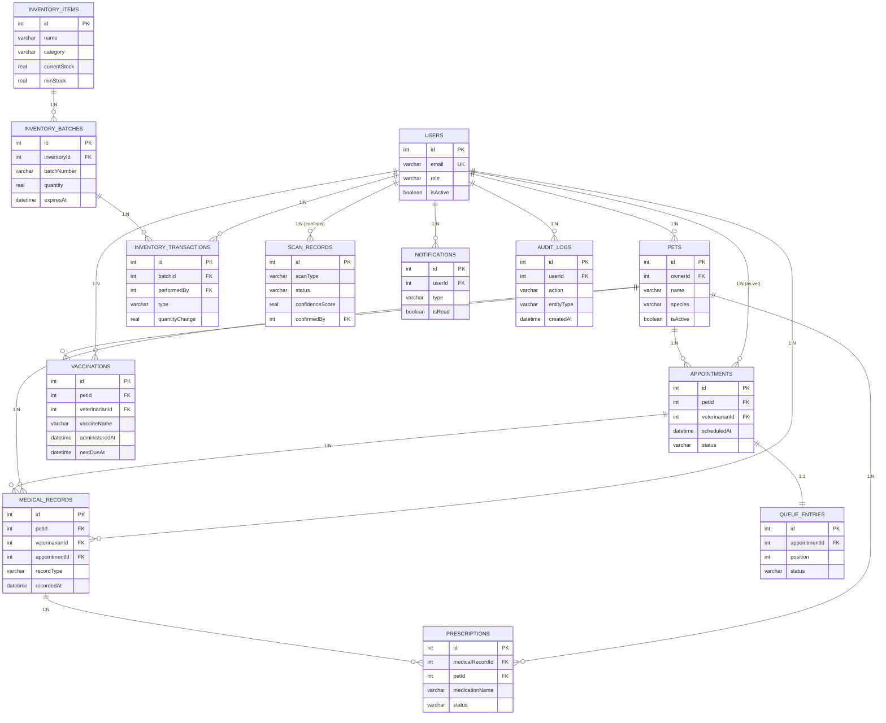

# CarePaw Entity Relationship Diagram

This document contains the complete Entity Relationship Diagram for the CarePaw Smart Veterinary Patient Management System in Mermaid format, suitable for thesis inclusion.

## Complete ER Diagram

```mermaid
erDiagram
    %% ==================== CORE ENTITIES ====================
    
    USERS {
        int id PK "auto_increment"
        varchar email UK "unique, 254 max"
        varchar passwordHash "bcrypt/argon2"
        varchar fullName "100 max"
        varchar phone "15 max, nullable"
        varchar role "PET_OWNER|VETERINARIAN|STAFF|ADMIN"
        varchar avatarUrl "nullable"
        boolean isActive "default true"
        datetime createdAt
        datetime updatedAt
    }
    
    PETS {
        int id PK "auto_increment"
        int ownerId FK "→ Users.id"
        varchar name "50 max"
        varchar species "DOG|CAT|BIRD|RABBIT|REPTILE|OTHER"
        varchar breed "50 max, nullable"
        datetime birthDate "nullable"
        real weightKg "nullable"
        varchar color "30 max, nullable"
        varchar microchipId "20 max, nullable"
        varchar avatarUrl "nullable"
        boolean isActive "default true"
        datetime createdAt
        datetime updatedAt
    }
    
    APPOINTMENTS {
        int id PK "auto_increment"
        int petId FK "→ Pets.id"
        int veterinarianId FK "→ Users.id"
        datetime scheduledAt
        int durationMinutes "default 30"
        varchar status "REQUESTED|CONFIRMED|CHECKED_IN|IN_PROGRESS|COMPLETED|CANCELLED|NO_SHOW"
        varchar reason "200 max, nullable"
        varchar notes "2000 max, nullable"
        datetime checkInAt "nullable"
        datetime startedAt "nullable"
        datetime completedAt "nullable"
        datetime cancelledAt "nullable"
        varchar cancellationReason "200 max, nullable"
        datetime createdAt
        datetime updatedAt
    }
    
    MEDICAL_RECORDS {
        int id PK "auto_increment"
        int petId FK "→ Pets.id"
        int veterinarianId FK "→ Users.id"
        int appointmentId FK "→ Appointments.id, nullable"
        varchar recordType "VISIT|VACCINATION|SURGERY|LAB_RESULT|PRESCRIPTION|NOTE|ALLERGY"
        varchar title "100 max"
        varchar description "2000 max, nullable"
        varchar diagnosis "1000 max, nullable"
        varchar treatment "1000 max, nullable"
        text medications "JSON, nullable"
        text attachments "JSON, nullable"
        datetime recordedAt
        datetime createdAt
    }
    
    VACCINATIONS {
        int id PK "auto_increment"
        int petId FK "→ Pets.id"
        int veterinarianId FK "→ Users.id"
        varchar vaccineName "100 max"
        varchar manufacturer "100 max, nullable"
        varchar batchNumber "50 max, nullable"
        datetime administeredAt
        datetime nextDueAt "nullable"
        varchar notes "500 max, nullable"
        datetime createdAt
    }
    
    PRESCRIPTIONS {
        int id PK "auto_increment"
        int medicalRecordId FK "→ MedicalRecords.id"
        int petId FK "→ Pets.id"
        varchar medicationName "100 max"
        varchar dosage "50 max"
        varchar frequency "50 max"
        int durationDays
        real quantity
        int refillsRemaining "default 0"
        varchar instructions "500 max, nullable"
        datetime prescribedAt
        datetime expiresAt "nullable"
        varchar status "ACTIVE|COMPLETED|CANCELLED|EXPIRED"
        datetime createdAt
    }
    
    %% ==================== INVENTORY ENTITIES ====================
    
    INVENTORY_ITEMS {
        int id PK "auto_increment"
        varchar name "100 max"
        varchar category "MEDICINE|VACCINE|SUPPLY|EQUIPMENT|FOOD"
        varchar unit "20 max"
        real currentStock "default 0.0"
        real minStock "default 0.0"
        real maxStock "nullable"
        real unitCost "nullable"
        varchar supplier "100 max, nullable"
        varchar location "50 max, nullable"
        datetime createdAt
        datetime updatedAt
    }
    
    INVENTORY_BATCHES {
        int id PK "auto_increment"
        int inventoryId FK "→ InventoryItems.id"
        varchar batchNumber "50 max"
        real quantity
        datetime receivedAt
        datetime expiresAt "nullable"
        real costPerUnit "nullable"
        varchar supplier "100 max, nullable"
        datetime createdAt
    }
    
    INVENTORY_TRANSACTIONS {
        int id PK "auto_increment"
        int batchId FK "→ InventoryBatches.id"
        varchar type "IN|OUT|ADJUSTMENT"
        real quantityChange
        real quantityBefore
        real quantityAfter
        varchar reason "200 max"
        varchar referenceType "50 max, nullable"
        int referenceId "nullable"
        int performedBy FK "→ Users.id"
        varchar notes "500 max, nullable"
        datetime createdAt
    }
    
    %% ==================== QUEUE ENTITIES ====================
    
    QUEUE_ENTRIES {
        int id PK "auto_increment"
        int appointmentId FK "→ Appointments.id"
        int position
        varchar status "WAITING|CALLED|IN_ROOM|COMPLETED|SKIPPED"
        datetime checkedInAt
        datetime calledAt "nullable"
        datetime roomEnteredAt "nullable"
        datetime completedAt "nullable"
        varchar room "nullable"
        int estimatedWaitMinutes "nullable"
        varchar notes "nullable"
        datetime createdAt
        datetime updatedAt "nullable"
    }
    
    %% ==================== SCANNING/OCR ENTITIES ====================
    
    SCAN_RECORDS {
        int id PK "auto_increment"
        varchar scanType "RECEIPT|MEDICINE_BOX|PRESCRIPTION|LAB_RESULT"
        varchar imagePath "500 max"
        text rawOcrText "nullable"
        text extractedData "JSON, nullable"
        real confidenceScore "nullable"
        varchar status "PENDING|CONFIRMED|REJECTED"
        int confirmedBy FK "→ Users.id, nullable"
        datetime confirmedAt "nullable"
        text corrections "nullable"
        datetime createdAt
    }
    
    %% ==================== NOTIFICATION ENTITIES ====================
    
    NOTIFICATIONS {
        int id PK "auto_increment"
        int userId FK "→ Users.id"
        varchar type "APPOINTMENT_REMINDER|QUEUE_UPDATE|PRESCRIPTION_READY|INVENTORY_LOW|SYSTEM"
        varchar title "100 max"
        varchar message "500 max"
        int referenceId "nullable"
        varchar referenceType "50 max, nullable"
        boolean isRead "default false"
        datetime readAt "nullable"
        datetime createdAt
    }
    
    NOTIFICATION_PREFERENCES {
        int id PK "auto_increment"
        int userId FK "→ Users.id, unique"
        boolean appointmentReminders "default true"
        boolean queueUpdates "default true"
        boolean prescriptionReady "default true"
        boolean inventoryAlerts "default true"
        boolean systemAnnouncements "default true"
        boolean emailEnabled "default true"
        boolean pushEnabled "default true"
        boolean inAppEnabled "default true"
        datetime createdAt
        datetime updatedAt
    }
    
    %% ==================== AUDIT/SECURITY ENTITIES ====================
    
    AUDIT_LOGS {
        int id PK "auto_increment"
        int userId FK "→ Users.id, nullable"
        varchar action "50 max"
        varchar entityType "50 max"
        int entityId "nullable"
        text oldValues "JSON, nullable"
        text newValues "JSON, nullable"
        varchar ipAddress "45 max, nullable"
        varchar userAgent "200 max, nullable"
        datetime createdAt
    }
    
    DEVICE_INFO {
        varchar id PK "UUID"
        varchar fcmToken "nullable"
        varchar firebaseUid "nullable"
        datetime createdAt
        datetime lastSyncAt "nullable"
        varchar platform "android|ios|web|etc"
        varchar appVersion "20 max"
    }
    
    SYNC_METADATA {
        varchar id PK "tableName:recordId:operation:timestamp"
        varchar tableName "50 max"
        int recordId
        varchar operation "INSERT|UPDATE|DELETE"
        text payload "JSON, nullable"
        int version "default 1"
        datetime createdAt
        datetime syncedAt "nullable"
        int retryCount "default 0"
        varchar lastError "nullable"
        varchar deviceId "100 max"
    }
    
    %% ==================== RELATIONSHIPS ====================
    
    USERS ||--o{ PETS : "owns"
    USERS ||--o{ APPOINTMENTS : "as_veterinarian"
    USERS ||--o{ MEDICAL_RECORDS : "records"
    USERS ||--o{ VACCINATIONS : "administers"
    USERS ||--o{ INVENTORY_TRANSACTIONS : "performs"
    USERS ||--o{ NOTIFICATIONS : "receives"
    USERS ||--o{ NOTIFICATION_PREFERENCES : "configures"
    USERS ||--o{ SCAN_RECORDS : "confirms"
    USERS ||--o{ AUDIT_LOGS : "performs"
    
    PETS ||--o{ APPOINTMENTS : "has"
    PETS ||--o{ MEDICAL_RECORDS : "has"
    PETS ||--o{ VACCINATIONS : "receives"
    PETS ||--o{ PRESCRIPTIONS : "prescribed_for"
    
    APPOINTMENTS ||--o{ MEDICAL_RECORDS : "generates"
    APPOINTMENTS ||--|| QUEUE_ENTRIES : "checks_in_to"
    
    MEDICAL_RECORDS ||--o{ PRESCRIPTIONS : "contains"
    
    INVENTORY_ITEMS ||--o{ INVENTORY_BATCHES : "has_batches"
    INVENTORY_BATCHES ||--o{ INVENTORY_TRANSACTIONS : "tracks"
```



## Simplified Core Domain ER Diagram

For thesis overview, here's a simplified version focusing on core domain relationships:



## Diagram Statistics

| Metric | Count |
|--------|-------|
| Tables | 14 |
| Primary Keys | 14 |
| Foreign Keys | 17 |
| Unique Constraints | 2 |
| Indexes | 35 |
| Enum Fields | 10 |

## Key Relationship Patterns

### 1. User-Centric Relationships
- **Users** is the central entity connecting to all domain entities
- Role-based access determined by `Users.role` field
- Soft deletion via `isActive` flag on Users and Pets

### 2. Pet-Centric Medical History
- **Pets** own all medical data (records, vaccinations, prescriptions)
- Owner access controlled via `Pets.ownerId → Users.id`
- Veterinarian access via appointment assignment

### 3. Appointment → Queue → Medical Record Pipeline
```
Appointment (REQUESTED)
    ↓ [confirm]
Appointment (CONFIRMED)
    ↓ [check-in]
QueueEntry (WAITING) → QueueEntry (CALLED) → QueueEntry (IN_ROOM) → QueueEntry (COMPLETED)
    ↓ [complete appointment]
Appointment (COMPLETED)
    ↓ [create record]
MedicalRecord (VISIT)
    ↓ [optional]
Prescription (ACTIVE)
```

### 4. Inventory Traceability Chain
```
InventoryItem (currentStock)
    ↓ [stock-in]
InventoryBatch (quantity, expiresAt)
    ↓ [consume FIFO]
InventoryTransaction (type=OUT, quantityBefore, quantityAfter)
    ↓ [update]
InventoryItem (currentStock updated)
```

### 5. Scan Verification Workflow
```
ScanRecord (PENDING, confidenceScore)
    ↓ [staff review]
ScanRecord (CONFIRMED/REJECTED, confirmedBy, corrections)
    ↓ [if CONFIRMED & MEDICINE_BOX]
InventoryTransaction (type=IN)
    ↓
InventoryBatch + InventoryItem updated
```

## Index Strategy Summary

| Table | Index | Purpose |
|-------|-------|---------|
| Users | email (UK) | Login lookup |
| Pets | owner_id | Owner's pets |
| Appointments | pet_id, veterinarian_id, scheduled_at, status | Multi-access queries |
| MedicalRecords | pet_id, veterinarian_id, record_type, recorded_at | History queries |
| Vaccinations | pet_id, next_due_at | Reminder queries |
| Prescriptions | pet_id, status, expires_at | Active prescriptions |
| InventoryItems | category, current_stock | Filtering & low-stock |
| InventoryBatches | inventory_id, expires_at | FIFO & expiry |
| InventoryTransactions | batch_id, reference, created_at | Audit trail |
| QueueEntries | appointment_id, status, position, room | Queue operations |
| ScanRecords | scan_type, status, confirmed_by, created_at | Processing queue |
| Notifications | user_id, type, is_read | Inbox queries |
| AuditLogs | user_id, entity_type, created_at | Security audit |
| SyncMetadata | table+record, syncedAt, deviceId, createdAt | Sync operations |

---

*This ER diagram is auto-generated from the Drift schema definitions in `lib/core/database/tables.dart`*