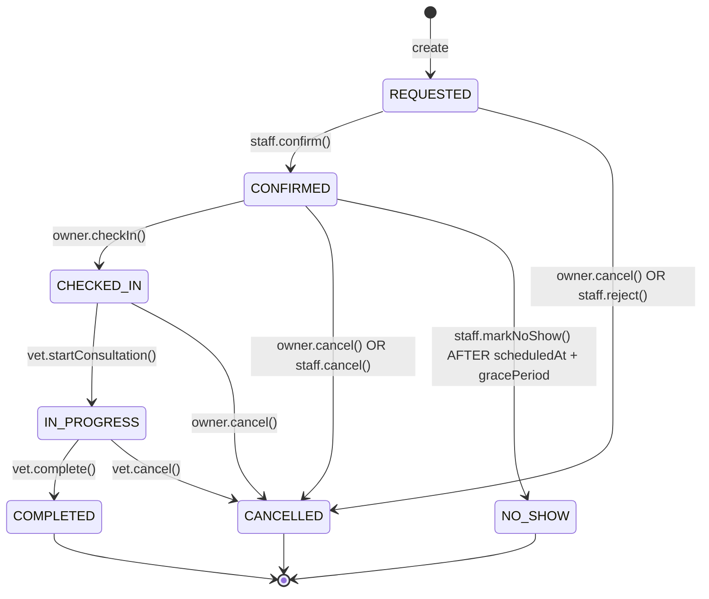
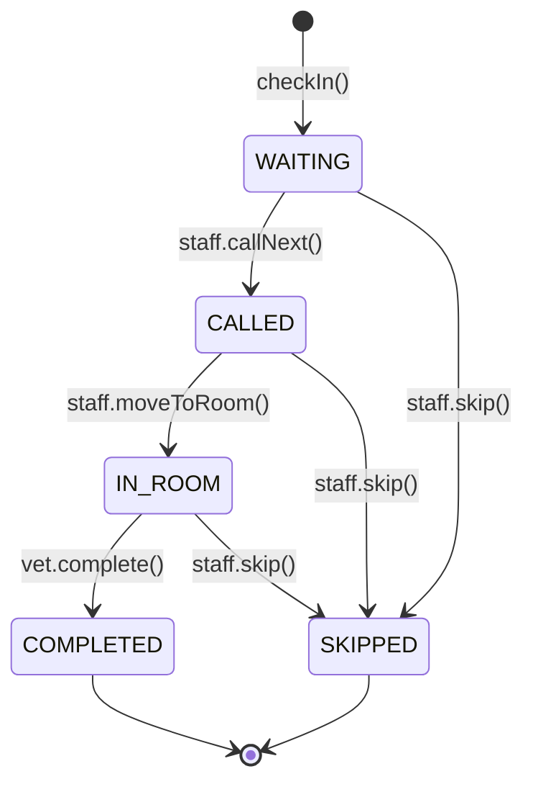
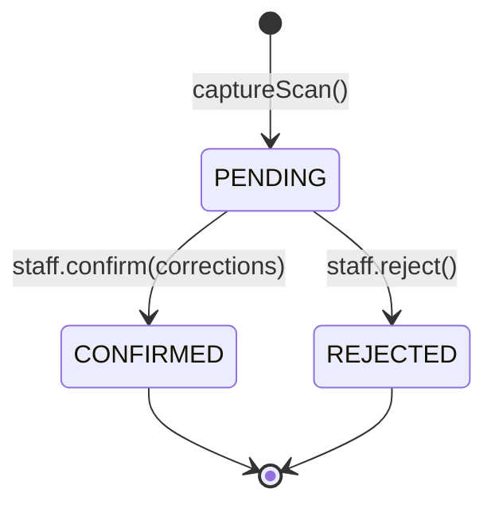
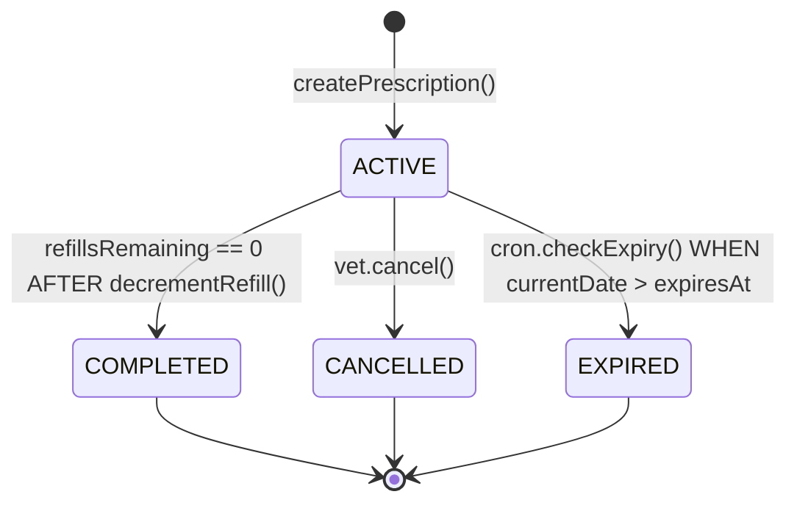
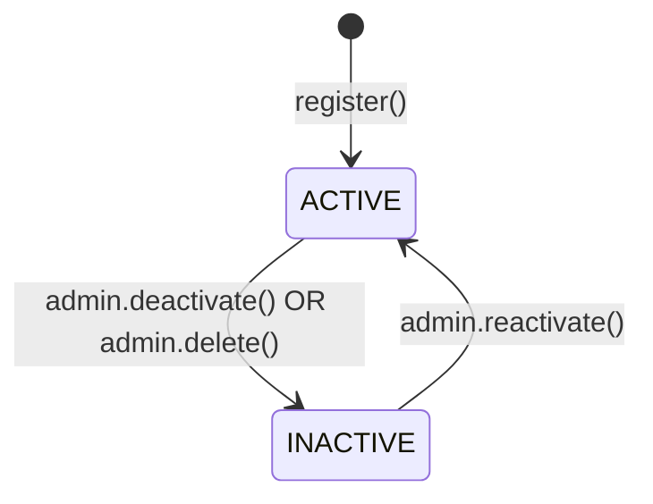
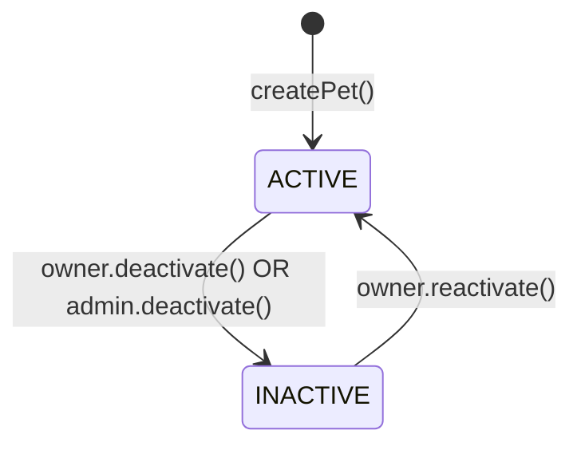
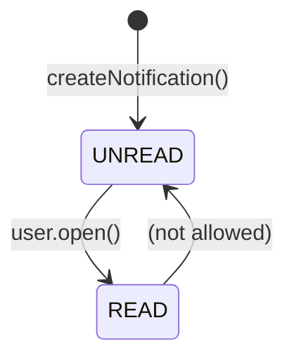
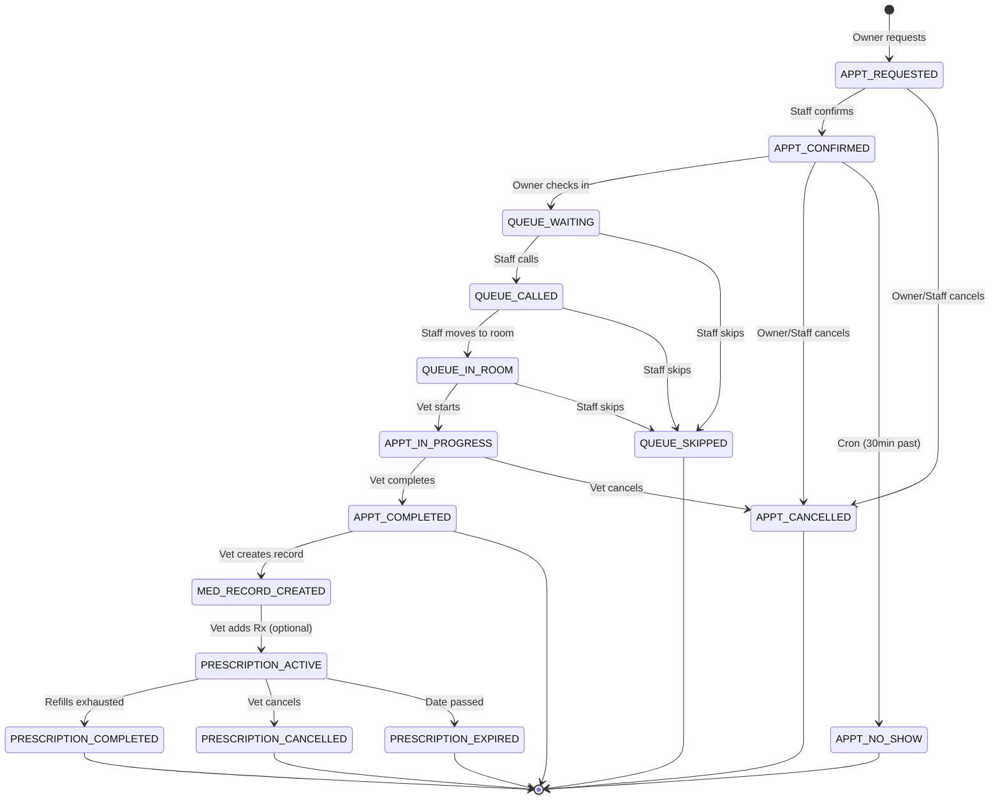

# CarePaw State Machines

This document defines the state machines for all key entities in the CarePaw system, including valid transitions, guards, and side effects.

---

## 1. Appointment Status State Machine

### States
| State | Description |
|-------|-------------|
| `REQUESTED` | Initial state - owner submitted request |
| `CONFIRMED` | Staff confirmed the appointment |
| `CHECKED_IN` | Pet owner checked in at clinic |
| `IN_PROGRESS` | Veterinarian started consultation |
| `COMPLETED` | Consultation finished, record created |
| `CANCELLED` | Cancelled by owner or staff |
| `NO_SHOW` | Patient didn't arrive |

### Transitions



### Transition Guards & Side Effects

| From → To | Guard | Side Effect |
|-----------|-------|-------------|
| REQUESTED → CONFIRMED | User has STAFF/ADMIN role | Create notification to owner |
| REQUESTED → CANCELLED | Owner owns pet OR Staff | Create notification to owner |
| CONFIRMED → CHECKED_IN | Appointment scheduled today | Create QueueEntry (position = next) |
| CONFIRMED → NO_SHOW | Current time > scheduledAt + 30min | Auto-transition by cron |
| CHECKED_IN → IN_PROGRESS | User is assigned veterinarian | Update appointment.startedAt |
| IN_PROGRESS → COMPLETED | User is assigned veterinarian | Create MedicalRecord, complete QueueEntry |
| IN_PROGRESS → CANCELLED | User is assigned veterinarian | Update appointment.cancelledAt |

### Terminal States
- `COMPLETED` - Normal completion
- `CANCELLED` - Explicit cancellation
- `NO_SHOW` - Missed appointment

### Invalid Transitions (Prevented)
- `COMPLETED` → any (terminal)
- `CANCELLED` → any (terminal)
- `NO_SHOW` → any (terminal)
- `REQUESTED` → `CHECKED_IN` (must confirm first)
- `REQUESTED` → `IN_PROGRESS` (must check in first)

---

## 2. Queue Entry Status State Machine

### States
| State | Description |
|-------|-------------|
| `WAITING` | Patient checked in, awaiting call |
| `CALLED` | Staff called patient name |
| `IN_ROOM` | Patient entered consultation room |
| `COMPLETED` | Consultation done |
| `SKIPPED` | Patient skipped (no-show in queue) |

### Transitions



### Transition Guards & Side Effects

| From → To | Guard | Side Effect |
|-----------|-------|-------------|
| WAITING → CALLED | Staff role | Update calledAt, notify owner |
| WAITING → SKIPPED | Staff role | repositionQueue() |
| CALLED → IN_ROOM | Staff role | Update roomEnteredAt |
| CALLED → SKIPPED | Staff role | repositionQueue() |
| IN_ROOM → COMPLETED | Veterinarian role | Update completedAt, appointment to COMPLETED |
| IN_ROOM → SKIPPED | Staff role | repositionQueue() |

### Queue Position Management
- Positions are **database-authoritative** (not UI-calculated)
- `repositionQueue()` called after SKIP/COMPLETE to close gaps
- Next position = MAX(position) + 1 for waiting entries
- Stream-based real-time updates via `watchCurrentQueue()`

---

## 3. Scan Record Status State Machine

### States
| State | Description |
|-------|-------------|
| `PENDING` | Scan captured, awaiting human review |
| `CONFIRMED` | Staff verified and approved |
| `REJECTED` | Staff rejected scan |

### Transitions



### Transition Guards & Side Effects

| From → To | Guard | Side Effect |
|-----------|-------|-------------|
| PENDING → CONFIRMED | Staff role | Update confirmedBy, confirmedAt; if MEDICINE_BOX: create InventoryBatch + InventoryTransaction(IN) + update InventoryItem.currentStock |
| PENDING → REJECTED | Staff role | Update confirmedBy, corrections; scan discarded |

### Critical Security Rule
> **NEVER** allow automatic transition from PENDING to CONFIRMED without human verification.
> Confidence score is informational only - does not auto-confirm.

---

## 4. Prescription Status State Machine

### States
| State | Description |
|-------|-------------|
| `ACTIVE` | Prescription active, refills available |
| `COMPLETED` | All refills used / duration expired |
| `CANCELLED` | Cancelled by veterinarian |
| `EXPIRED` | Past expiresAt date |

### Transitions



### Transition Guards & Side Effects

| From → To | Guard | Side Effect |
|-----------|-------|-------------|
| ACTIVE → COMPLETED | refillsRemaining reaches 0 | Notify owner |
| ACTIVE → CANCELLED | Veterinarian role | Notify owner |
| ACTIVE → EXPIRED | Daily cron job | Notify owner |

---

## 5. Inventory Transaction Type (Immutable)

### Types
| Type | Description | Stock Effect |
|------|-------------|--------------|
| `IN` | Stock received (purchase, return) | +quantity |
| `OUT` | Stock consumed (prescription, use) | -quantity |
| `ADJUSTMENT` | Manual correction (count, damage) | +/- quantity |

### Important Notes
- InventoryTransaction records are **IMMUTABLE** (no status transitions)
- Each transaction records: `quantityBefore`, `quantityChange`, `quantityAfter`
- FIFO consumption: `consumeFromBatches(itemId, quantity)` uses earliest expiring batches first
- Audit trail preserved forever - no deletion of transactions

---

## 6. User Active Status (Soft Delete)

### States
| State | Description |
|-------|-------------|
| `ACTIVE` | User can log in and use system |
| `INACTIVE` | User deactivated, cannot log in |

### Transitions



### Guards & Side Effects
| From → To | Guard | Side Effect |
|-----------|-------|-------------|
| ACTIVE → INACTIVE | ADMIN role | Log to audit_logs, revoke sessions |
| INACTIVE → ACTIVE | ADMIN role | Log to audit_logs |

---

## 7. Pet Active Status (Soft Delete)

### States
| State | Description |
|-------|-------------|
| `ACTIVE` | Pet visible, can have appointments |
| `INACTIVE` | Pet hidden from normal views |

### Transitions



### Guards & Side Effects
| From → To | Guard | Side Effect |
|-----------|-------|-------------|
| ACTIVE → INACTIVE | Owner OR ADMIN | Future appointments cancelled, past records preserved |
| INACTIVE → ACTIVE | Owner | No side effects |

---

## 8. Notification Read Status

### States
| State | Description |
|-------|-------------|
| `UNREAD` | Notification not viewed |
| `READ` | User opened notification |

### Transitions



### Guards & Side Effects
| From → To | Guard | Side Effect |
|-----------|-------|-------------|
| UNREAD → READ | User owns notification | Update readAt = NOW() |

---

## 9. Combined State Diagram: Appointment → Queue → Medical Record



---

## 10. Implementation Mapping (Drift Schema ↔ State Machines)

### AppointmentStatus Enum (Dart)
```dart
enum AppointmentStatus {
  requested('REQUESTED'),
  confirmed('CONFIRMED'),
  checkedIn('CHECKED_IN'),
  inProgress('IN_PROGRESS'),
  completed('COMPLETED'),
  cancelled('CANCELLED'),
  noShow('NO_SHOW');
}
```

### QueueEntry Status Enum (Dart)
```dart
enum QueueStatus {
  waiting('WAITING'),
  called('CALLED'),
  inRoom('IN_ROOM'),
  completed('COMPLETED'),
  skipped('SKIPPED');
}
```

### ScanRecord Status Enum (Dart)
```dart
enum ScanStatus {
  pending('PENDING'),
  confirmed('CONFIRMED'),
  rejected('REJECTED');
}
```

### Prescription Status Enum (Dart)
```dart
enum PrescriptionStatus {
  active('ACTIVE'),
  completed('COMPLETED'),
  cancelled('CANCELLED'),
  expired('EXPIRED');
}
```

### Database Constraint Enforcement
```sql
-- Appointment status transitions enforced in application layer (DAO)
-- No CHECK constraint for state machine due to complexity
-- DAO methods validate before transition

-- Example from QueueDao:
-- callNext() only allows WAITING → CALLED
-- complete() only allows IN_ROOM → COMPLETED
```

---

## 11. Testing Matrix

| State Machine | Valid Transitions | Invalid Transitions | Terminal States |
|---------------|-------------------|---------------------|-----------------|
| Appointment | 8 | 15+ | 3 |
| Queue | 6 | 10+ | 2 |
| ScanRecord | 2 | 4+ | 2 |
| Prescription | 3 | 6+ | 3 |
| User (isActive) | 2 | 1 | 1 (soft) |
| Pet (isActive) | 2 | 1 | 1 (soft) |
| Notification | 1 | 1 | 1 |

### Critical Test Cases
1. **Appointment**: Cannot check in unless CONFIRMED
2. **Queue**: Cannot skip completed entries; reposition after skip
3. **Scan**: PENDING → CONFIRMED requires staff role + corrections
4. **Prescription**: Cannot refill if COMPLETED/CANCELLED/EXPIRED
5. **Inventory**: Transaction type immutable after creation

---

## 12. Thesis Notes

### Why These State Machines Matter

1. **Data Integrity**: Explicit states prevent invalid combinations (e.g., completed appointment with waiting queue entry)
2. **Auditability**: Every transition logged with actor, timestamp, reason
3. **Authorization**: Role-based guards enforce who can trigger transitions
4. **Traceability**: Inventory transactions + batch tracking = full traceability
5. **Safety**: Human verification gate on OCR prevents data corruption

### Design Decisions

| Decision | Rationale |
|----------|-----------|
| App-enforced transitions (not DB CHECK) | Complex multi-table conditions; flexibility for edge cases |
| Soft delete (isActive) | Preserves medical history, audit trail, relationships |
| Immutable transactions | Financial/operational audit requirement |
| FIFO batch consumption | Regulatory compliance (expiry management) |
| Database-authoritative queue | Prevents race conditions, works offline-first |
| Human verification for OCR | Safety-critical: wrong medicine = patient harm |

---

*These state machines are implemented in the domain entities under `lib/features/*/domain/entities/*.dart` and enforced in DAO methods under `lib/core/database/dao/*.dart`.*