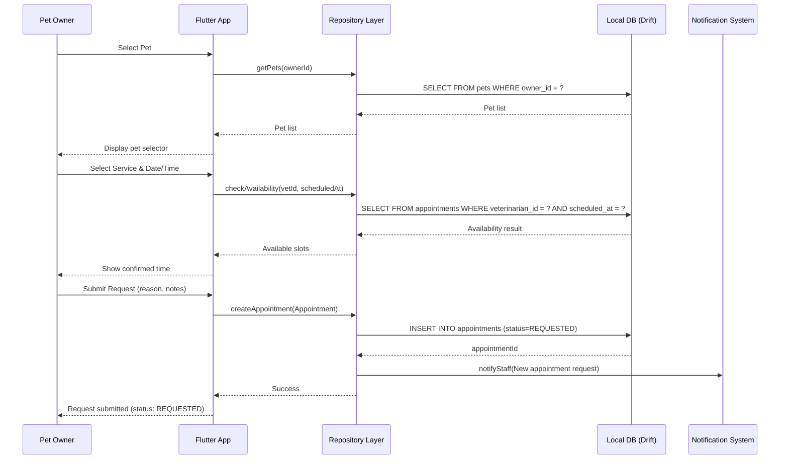
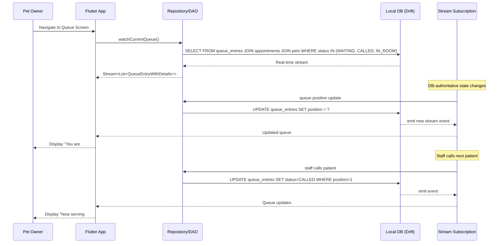
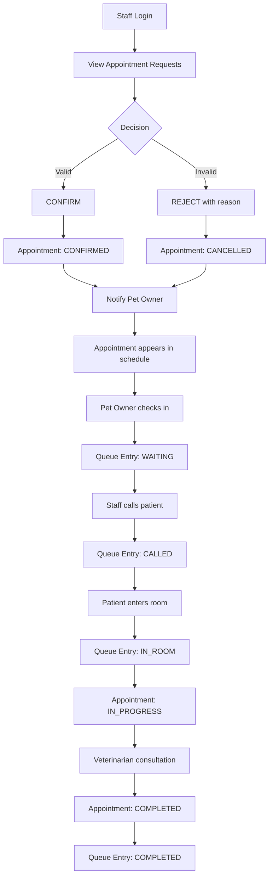
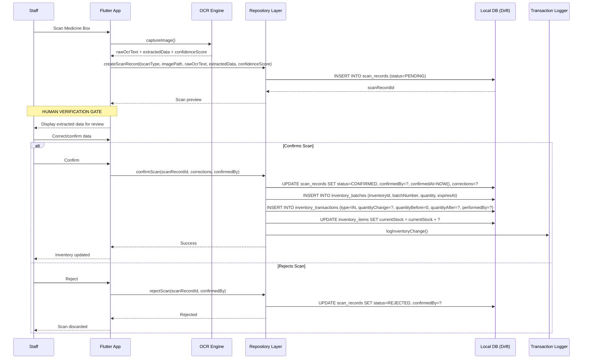
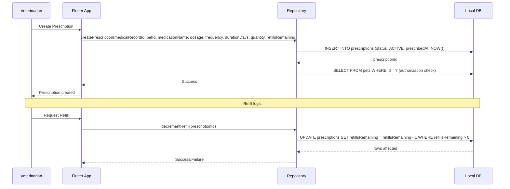
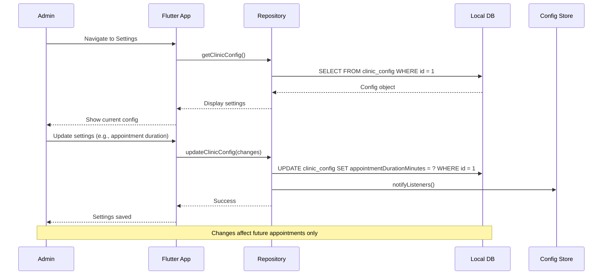
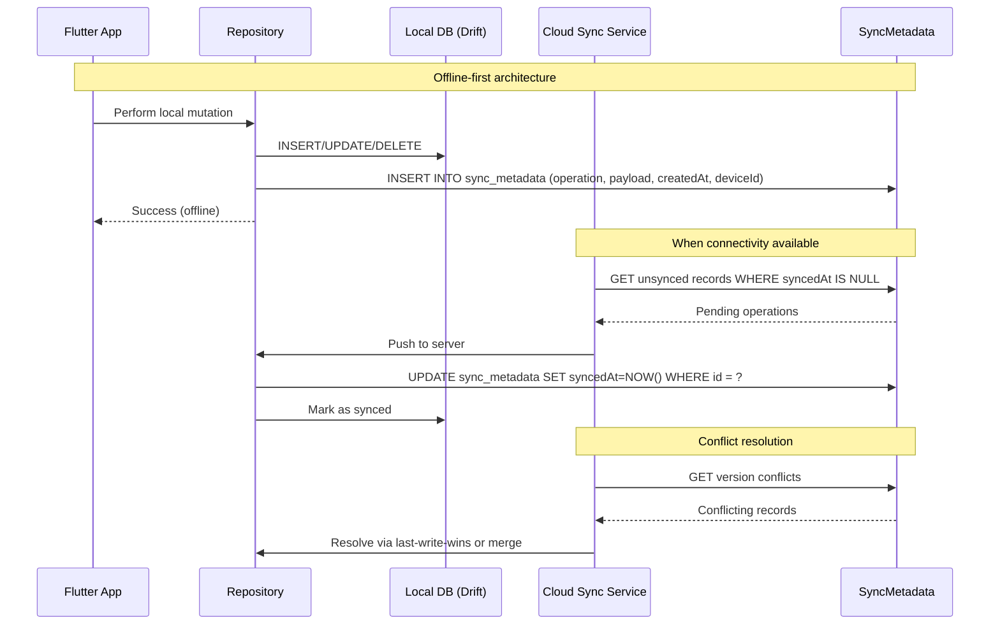
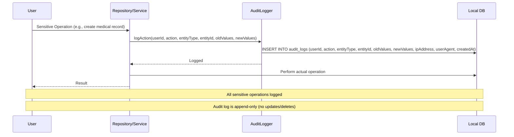

# CarePaw System Workflows

This document describes the key workflows of the CarePaw Smart Veterinary Patient Management System, suitable for thesis documentation.

## 1. Pet Owner Journey

### 1.1 Appointment Request Workflow



### 1.2 Queue Monitoring Workflow



---

## 2. Veterinary Staff Journey

### 2.1 Appointment Management Workflow



### 2.2 Inventory Scanning Workflow



---

## 3. Veterinarian Journey

### 3.1 Medical Record Creation Workflow

```mermaid
flowchart TD
    A[Vet Login] --> B[View Assigned Appointments]
    B --> C[Select Appointment IN_PROGRESS]
    C --> D[Open Pet Record]
    D --> E[Review Medical History]
    E --> F[Perform Consultation]
    F --> G[Create Medical Record]
    G --> H{Record Type?}
    H -->|VISIT| I[Record diagnosis, treatment]
    H -->|VACCINATION| J[Record vaccine name, batch, next_due]
    H -->|LAB_RESULT| K[Attach results]
    H -->|PRESCRIPTION| L[Create Prescription]
    
    I --> M[INSERT INTO medical_records]
    J --> M
    K --> M
    L --> N[INSERT INTO prescriptions]
    N --> M
    
    M --> O[Notify Pet Owner]
    O --> P[Record Complete]
    
    Note over D,M: APPEND-ONLY INTEGRITY
    Note over D,M: No destructive updates
    Note over E: Authorization check: vet can only access assigned pets
```

### 3.2 Prescription Management



---

## 4. Administrator Journey

### 4.1 User Management Workflow

```mermaid
flowchart TD
    A[Admin Login] --> B[Audit Dashboard]
    B --> C[Review Audit Logs]
    C --> D{Action Required?}
    D -->|Suspicious Activity| E[Deactivate User]
    D -->|Routine| F[Export Report]
    D -->|User Request| G[Role Change]
    
    E --> H[UPDATE users SET isActive=false]
    G --> I[UPDATE users SET role=?]
    F --> J[Generate CSV/PDF]
    
    H --> K[Log admin action to audit_logs]
    I --> K
    J --> K
    
    Note over A,K: All admin actions logged
    Note over A,K: Authorization enforced server-side
```

### 4.2 System Configuration Workflow



---

## 5. Cross-Cutting Workflows

### 5.1 Notification Delivery Workflow

```mermaid
flowchart LR
    A[Event Trigger] --> B{Notification Type?}
    B -->|APPOINTMENT_REMINDER| C[Check user preferences]
    B -->|QUEUE_UPDATE| C
    B -->|PRESCRIPTION_READY| C
    B -->|INVENTORY_LOW| C
    B -->|SYSTEM| C
    
    C --> D{User enabled?}
    D -->|Yes| E[Create notification record]
    D -->|No| F[Skip]
    
    E --> G{Channel enabled?}
    G -->|In-App| H[Store in notifications table]
    G -->|Push| I[Send FCM push]
    G -->|Email| J[Send email via service]
    
    H --> K[Mark as UNREAD]
    I --> K
    J --> K
    
    Note over E,K: Never expose sensitive medical info in notifications
```

### 5.2 Data Sync Workflow



### 5.3 Audit Logging Workflow



---

## State Machine Summary

| Entity | States | Initial | Terminal States |
|--------|--------|---------|-----------------|
| Appointment | REQUESTED, CONFIRMED, CHECKED_IN, IN_PROGRESS, COMPLETED, CANCELLED, NO_SHOW | REQUESTED | COMPLETED, CANCELLED, NO_SHOW |
| QueueEntry | WAITING, CALLED, IN_ROOM, COMPLETED, SKIPPED | WAITING | COMPLETED, SKIPPED |
| ScanRecord | PENDING, CONFIRMED, REJECTED | PENDING | CONFIRMED, REJECTED |
| Prescription | ACTIVE, COMPLETED, CANCELLED, EXPIRED | ACTIVE | COMPLETED, CANCELLED, EXPIRED |
| InventoryTransaction | IN, OUT, ADJUSTMENT | (type at creation) | (immutable) |
| User | ACTIVE, INACTIVE (isActive flag) | ACTIVE | INACTIVE (soft delete) |
| Pet | ACTIVE, INACTIVE (isActive flag) | ACTIVE | INACTIVE (soft delete) |
| Notification | UNREAD, READ | UNREAD | READ |

---

## Key Workflow Principles

1. **Database-Authoritative State**: All state transitions happen in DB, not in UI
2. **Human Verification**: OCR scans never auto-update inventory
3. **Traceability**: Every inventory change logged as transaction
4. **Append-Only**: Medical records never destructively updated
5. **Soft Deletion**: Users/Pets use isActive flag, not hard delete
6. **Authorization Enforced**: Server-side checks, not UI-only
7. **Audit Trail**: All sensitive operations logged
8. **Offline-First**: Local mutations tracked in sync_metadata
9. **Notification Safety**: No sensitive medical info in notifications
10. **FIFO Inventory**: Batches consumed by expiration date

---

*These workflows are implemented in the feature-layer architecture under `lib/features/*/presentation`, `lib/features/*/application`, and `lib/features/*/data`.*